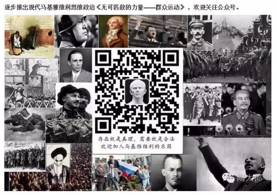

# 这一个大卷，被称之为《liberté、égalité、fraternité》

这三个词是法文。翻译过来，就是耳熟能详的"平等，自由，博爱"。

 

 

本来这一卷并不在写作提纲上。只不过近期王陶陶连发几篇文章。阐述新疆和伊斯兰问题。

 

《当马基雅维利统治新疆：伊斯兰与现代化》

《新疆长治久安的新思维：1、跳出伊斯兰恐惧》

《2、新疆分区治理的必要性：长治久安新思路》

《新疆长治久安新思维：走出现代化的迷信》

《马基雅维利看世界：反恐为何如此困难？》

《如何治理伊斯兰：摸索有效的政治架构》

 

（陶太郎公众号的二维码。文章链接懒得贴了） 

我完全不同意他的观点

 

至于这件事，要说清楚，却也不容易。

拨丝抽茧，应该有好几篇的篇幅。

 

 

所以开始写《平等、自由、博爱》卷。其实这是一件亏本的事。

因为"二会"期间，气氛极度收紧。

\#F政治系列，凡写了也一定不会群发的。

 

只剩下一些核心老网友，会以\#F920的数字编号索取。

正常的群发文章，40000阅读。

点播的连4000阅读也没有。

 

 

又不涨粉，又不赚钱。

写这种长幅学术文章耗费心力，呕心沥血之作，一篇耗十几个小时。

实在是件亏本买卖。

 

 

 

（yevon\_ou\@163.com，2017年3月4日晨）
