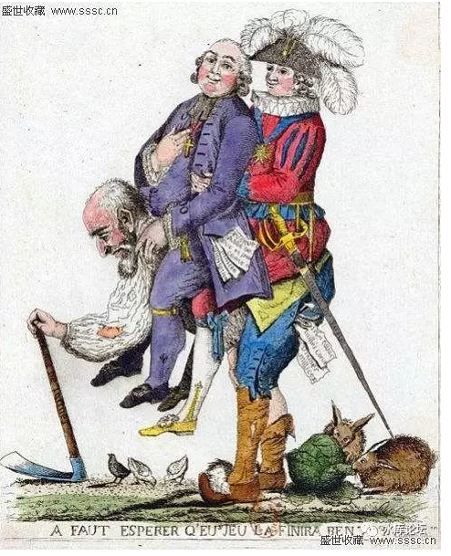

# 一）石器

 

石木时代，人类第一个文明"古巴比伦"王国。毁于神庙制度（BC3500）

 

古巴比伦以"淫荡"出名。几乎每一个女性，都要到阿芙洛蒂忒神庙当"圣妓"。并要为陌生的过路人提供服务。[\[1\]]

她们不知道，这样会让她们感染白病。最终王国内的男子人人染病，无力作战。被野蛮亚述征服。

 

青铜器时代，人类的第二波文明，在"雅典学院"达到顶峰。百家齐放的哲学和数学思想，即使到今天仍熠熠生辉。

雅典毁于"群愚时代"，毁于伯罗奔尼撒战争。

 

 

铁器时代，人类的第三波文明。罗马建立了庞大的地中海帝国。

AD212，卡拉卡拉皇帝颁布"公民令"，被公认为罗马由盛转衰的节点。

此后罗马无兵可战，无人可用。

AD476西罗马帝国灭亡。人类陷入了1000年的黑暗"中世纪"时代。

 

 

 

以上种种，被称之为"进步主义"。

马克思说，生产关系要适合生产力。

当人类生产力发展了，尤其是有突破性飞跃时，就需要尝试新的制度，新的社会方法。

 

遗憾的是，当人类尝试"新方法"时，他并不一定确定新方法就是"对"的。

也有可能是大坑。

 

 

文明的竞争，是一场永不落幕的长跑。

在文明竞赛中，"先行者惩罚"是非常非常严重的。

 

领跑的国家，危险最大。因为他每一步"创新"，前方都有可能是地雷阵。

巴比伦，雅典，罗马，都是当时No.1的强国。踩中地雷，挂了。

 

而跑在后面的第二，第三名，则没有那么大的危险。

"先行者惩罚"，后人哀之而鉴之。知道了哪里是雷区，绕开即可。

直到你自己是No.1

 

 

这样一股思潮，被称之为"进步主义"。

进步是需要的。没有进步，人类至今还在非洲树上当猩猩。

但是"进步"是危险的。和进步相对应的，则称之为"保守主义"。

 

简称：[左翼和右翼](http://mp.weixin.qq.com/s?__biz=MzAxNTMxMTc0MA==&mid=2651014622&idx=1&sn=7bf5c8ae5bb349fa570ba6068e8c7565&scene=21#wechat_redirect) [\[2\]]

 

 

 

二）工业革命

 

我们目前的人类社会，正处于第四波："工业革命"或称为"化石能源革命"。

 

1750年英国开始"工业革命"，打开了潘多拉魔盒。

此后二百七十年，人类生产力以指数爆发式增长。目前已登上了月球外太空。

1789年，就发生了"法国大革命"。

 

 

法国大革命，是一场非常自然的显现。生产力变了，生产关系自然也需要变。

此前的法兰西3级社会，已经被证明极大地桎梏了资本主义发展。

皇帝，贵族，和层层分封制。适合于铁器时代，不适合大工业时代。

 

听起来是不是很熟悉。以上全部都是教科书上的内容。以下就不是了：

 

 

法国大革命，砍掉了Louise XVI的脑袋。摧毁了皇帝，教士和贵族阶层。

旧制度荡然无存。

可是现在问题来了，新世界应该如何建设？

 

你说路易十六不适合大机器大工业时代，You can u up，你行你来啊。

你倒是说说看，"大工业"时代，社会应该如何组织？

 

 

对于这个问题，坦白说1789年的当事人。是没有任何一个有任何腹稿的。

在之前接近一个世纪的"启蒙运动"中，最主要的思想家是卢梭，孟德斯鸠。

 

卢梭的人品十分败坏。他和厨娘生了5个孩子，但却把5个孩子全部都送到孤儿院。

卢梭完全没有任何执政经验，他关于"理想社会"的说法，绝大多数由他空想而来。

 

 

当法国人砍掉了国王的脑袋，他们拿来卢梭的书籍。翻来翻去，到最后翻出来了六个字：

平等、自由、博爱

 

 

必须指出的是，这六个字，哪一个都没有经历过事实的检验。

哪怕连最基础的"特区实践"都没有。

 

人类的铁器时代，延续近二千年。

所有的政治制度，都经过充分博弈，充分践行，充分尝试。

史料汗牛充栋。"谋与断"，前因与后果，每一件事都可以从历史血的教训寻找前例。

 

 

但"工业时代"不一样。当法国大革命提出"平等，自由，博爱"口号时；

-   他们心里是没底的。

-   哪一件都不是绝对真理。

-   地雷阵大坑就在眼前

 

 

但是，时间已不允许再继续等下去了。因此"平等，自由，博爱"就成了法国大革命三条准则，贯穿之后的二百七十年。

 

 

 

三）拿破仑

 

在前文《史料菟集》故事四：亚伯拉罕战役中，我们讲述了"精锐英军"的故事。

 

 

在毛瑟枪时代，精锐训练十分地重要。尤其是"枪阵"，排不好队形，则战斗力大大打折扣，几乎是必胜必败的诀窍。[\[3\]]

 

1789年法国大革命，在那个时候，"命运之神"偷偷地拨动了一枚小念珠。

"滑膛枪"Rifle被列装了。[\[4\]]

 

 

如果说Musket的有效射程只有18米，而Rifle在一百米的距离上，还能保证90%的射中精度。

此外，滑膛枪的装填速度，火药和弹丸的威力，也有了很大的提高。

 

这些事情的合力作用，是密集阵型不再显得那么有效。

职业军人花费了大力气培养出来的"整齐"方阵，反而放大了伤亡率。

当你踏步靠近之前，敌人可以射7\~8枪。

 

 

而另一方面，"散兵线"成了最合理的阵型。

漫山遍野呼啸而来，充满了朝气蓬勃，个人战术能力很强，而团队配合能力极差的"游侠"，反而成了最有威力的火枪手。

 

 

各位，"造反"这种事，也是讲天时地利人和的。

在武器史上，武器的发展是随机的，但往往会朝向二个方向。

-   有利于极少数精锐的部队

-   有利于大数目海量的部队

 

 

当前者发生时，统治集团往往会非常地小。只需要一个很小团体，因而可以维持贵族统治。

典型的例子如：青铜器早期，重骑兵发明，隐形战斗机发明。

 

而当后者发生时。有利于"人民起义"，用数量抵消掉质量优势。常常会建立起扁平化，平民化的政权。

典型如：弩刚发明时，来复枪时代，炮兵时代。

 

 

 

法国大革命的第二个bug，是"加农炮"时代。

加农炮就是19世纪的坦克。

 

一开始，各国其实都有加农炮。但是把大炮分散配置，平均协防在每一个步兵连队。

 

现代坦克战之父，德国大将古德里安曾经说过：

 

因为把坦克分配给各步兵师，所以有一部分坦克被置于其无法活动的地区，无所事事；另一部分坦克虽然可以活动，但是却受制于地形，使成功运用它们的希望显得十分缈茫；结果在最适于坦克活动的地区，红军只能集中起它全部坦克的三分之一投入战斗。

 

因此坦克需要集中起来，在最需要的地方，投入一整个坦克师。

在局部地区，形成二倍以上的压倒性优势。

 

 

军事的逻辑都是相通的。加农炮就是一百年前的坦克。

拿破仑说"上帝站在大炮更多的一方"。

 

在拿破仑战争早期，几乎所有的敌军都被拿破仑炸得七荤八素。和"闪电战"早起类似。

这也锻造了军神的不败声名。

 

 

但是到了后期，大家逐渐也都学乖了。

"一招鲜"优势还有，但没有那么大了。

直到Waterloo威灵顿击败拿破仑。

 

（威灵顿结成巨大的步兵方阵，对抗呼啸而过的法国骑兵。但这绝佳的炮兵靶子，拿破仑手上居然无兵可用。导致了滑铁卢战败）

扯得有点远了。来复枪+拿破仑，这二个战争bug，造成了什么结果呢。

结果是欧洲人觉得"拿破仑"很强，非常强。

尤其是年轻人当中，形成了一股"崇拜拿破仑"的风潮。

 

 

各位，我们知道拿破仑时代是1803\~1815年。滑铁卢战败之后，波旁王朝的路易十八复辟。法国依然是个帝制国家。

从字面上看，似乎一切都没有改变。欧洲各国皇帝都在。

 

但是，暗潮下，暗流涌动。

"法国大革命"是一枚炸弹，一旦引爆了，就不可能塞回弹筒。

 

 

 

当我们写《我们会信奉邪魔么》\#F910，人类真正信仰的是什么。

是上帝，菩萨，耶稣，还是安拉。

都不是。

人类真正相信的，是力量。

只要你展示过了力量，展示过了肌肉。你就一定会有信徒，千山万水都会有人爬来解开恶龙的封印。

 

 

既然人们普遍认为共和制比帝制更适合工业革命，那么帝制就已经死了。

剩下的，仅仅是帮他棺材盖上浮土。

 

关键是大义的名分

关键是大义的名分

关键是大义的名分！

重要的事情说三遍。

 

如果人们认为儒家是有生命力的，则君权就永远也不会被打到。

如果人们认为儒家是没有生命力的，则皇帝一定会垮台。

 

 

"拿破仑战争"之后，虽然欧洲各国皇室的王冠仍在。但是他们的"根"已经烂掉了。

年轻人不再相信帝制，一旦有风吹草动，很容易切换到"共和制"。

而帝制一旦被推翻，就再也无法复起。

 

-   1848年革命：法国，巴伐利亚，捷克，匈牙利

-   1918年：德国，俄国，奥地利，土耳其

-   立宪过渡：英国，丹麦，西班牙，荷兰，葡萄牙

 

 

算上小国的话，这个名单还可以列得更长。

但总体而言，如果国民全都笃信"封建帝制是腐朽的"。那皇帝是万万玩不下去的。

 

知情知趣乖巧的，象英国，丹麦这样搞"君主立宪"。丹麦"弗雷德里克七世"，几乎是投降般的，在议会所有空白文件上签字。

 

而稍微死颈强硬的，例如德皇，俄皇，土耳其皇帝，则是在"革命"和"战败"中被炸得粉身碎骨。连家族都不能保全。

 

 

我们曾经写过《无可匹敌的力量》~\#F640~，真正的力量，是"大义的力量"。

如果你不能从意识形态上为自己背书；

你就是沙滩上的泥足巨人，看似魁梧庞大，实则不堪一击。

 

 

 

哦，好了，这一章你写什么长。想要表达什么意思。

我们想说的是，拿破仑是个bug，军神逆天这种事，其实不适合"历史的正常发展"。

 

因为拿破仑太强，给了欧洲年轻人一种幻觉。以为"平等，自由，博爱"强。

以为他们找到了强盛的秘诀。

 

他们顺延着"法国大革命"的思潮走下去。

却没有想过，这条路是不是条死路，坑路，断头路。

 

（未完待续）

 

 

（yevon\_ou\@163.com，2017年3月6日子夜）

 

 

 

[\[1\]]《探秘古巴比伦王国毁灭于奇异淫乱性风俗》http://bbs.tiexue.net/post\_6969856\_1.html

[\[2\]]参考阅读《什么是左翼，什么是右翼》。请回复\#F420获取。

[\[3\]]一种说法是，如果你阵线参次不齐。则必有士兵预先落入敌人射程。

如果敌人阵线参次不齐，则必有士兵，在开枪之前落入你的射程。造成损耗。

[\[4\]]玩过CIV的人都知道，Musket和Rifle的区别。
