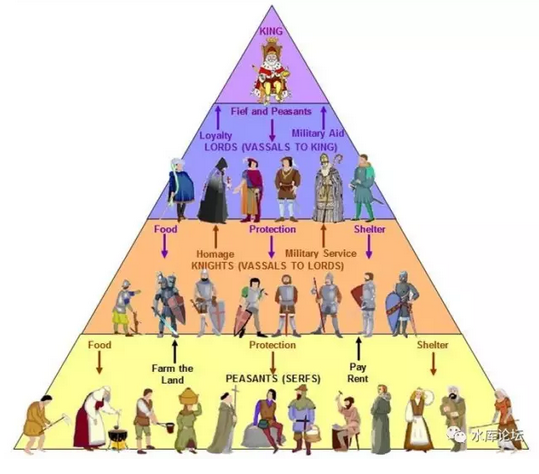
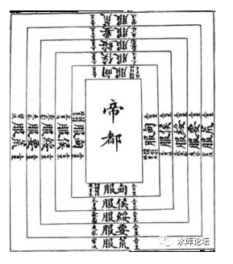
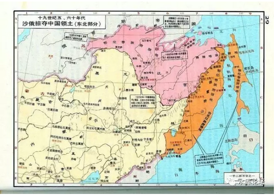
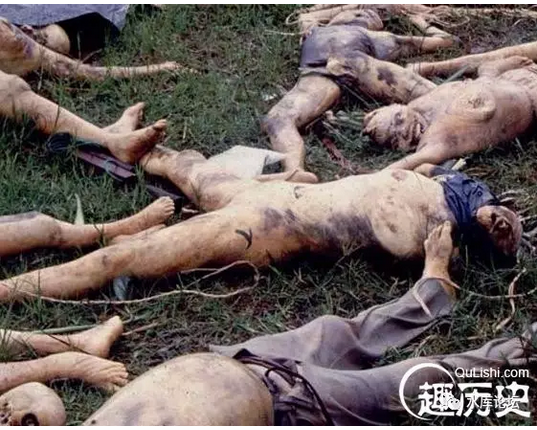
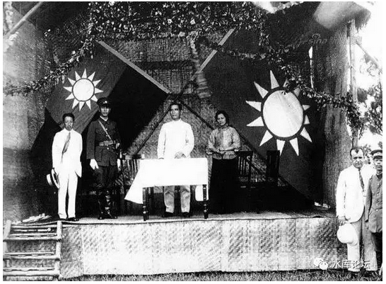

# 民族国家并不是亘古之物

 

 

一）臣属

 

在法国和西班牙的夹缝之中，有一个国家名叫"安道尔"。

 

安道尔人口25000人。他同时是法国和西班牙的臣属。

单数年给西班牙进贡100美元。

双数年给法国进贡2美元，20根火腿，一只腌鸡，12块奶酪。[\[1\]]

 

 

 

1962年，举世闻名的避税天堂，全球房价No.1的摩纳哥发生"外交危机"。

因不满Monaco避税天堂，法国陈兵摩纳哥边境。意图吞并Monaco。

 

格蕾丝召开盛大的宴会，遍请欧美的名流。

美国大使被她的美丽感动。私下对戴高乐说，"你不会真想扔集束炸弹，扔在这位高位的夫人头上吧"。

"摩纳哥---法国"危机因此而解除。 

                             

当中国人看这段历史时，他会感到十分困惑。

这是1962年，不是1862年啊。"殖民时代"早已经结束，联合国也成立了近二十年。

 

为什么法国还可以吞并一个"主权国家"呢。

而且似乎各国对这行为是默许的。没有友邦惊诧。

 

真实的答案是，"摩纳哥\-\--法国"的关系是很复杂的。

从繁复的谱系以及传承来说，法国对摩纳哥是拥有一定的"宗主权"的。类似于中国和西欌的关系。

 

 

 

1894年，中日"甲午战争"中国惨败。

作为主要的战利品。日军签订《马关条约》。而马关条约的核心利益，在于第一条。

 

《马关条约》第一款:

中国认明朝鲜国确为完全无缺之独立自主国。故凡有亏损其独立自主体制，即如该国向中国所修贡献典礼等，嗣后全行废绝。

 

这一条，被称为"国体"条款。

书面确认朝鲜为一"完整主权国家"，为日后日本吞并朝鲜，铺平了道路。

 

 

因为在历史上，中国和朝鲜，彼此的关系是非常非常复杂的。

并不是平等的"国与国"外交关系。

也不是"省级"，中央和地方的关系。

而是"宗主国"，次一级的羁縻州制度。

 

这种关系，在现代国际政治，是不存在的。

 

 

 

二）国家

 

我们举了三个例子，是想告诉各位，"正史的真相"我们现在所践行的国家，自古以来是不存在的。

 

 

包括国旗，国歌，国徽。

领土，领海，领空，领电磁域，领太空。

 

从我们上小学的第一天起，排排坐教室里，老师就给我们洗脑；

"国家的领土和主权神圣不可侵犯"。

 

小学教师告诉我们，国家是神圣的。领土和领空一寸也不可以割让。为了万里之外一块荒芜的土地，可以牺牲流尽战士们的学。以捍卫"国家"的尊严。

 

这种教育是有极大的问题的。

 

我不想简单的说它对错，毕竟我本人也是一个典型的皇汉主义者。

我想指出的是，如果人类文明有5000年；

则4800年不是这样运行的，只有200年，才是"近代民族国家"。

 

 

 

过去的4800年，人类文明是怎样运行的呢。他分为西方，东方二个模板。

在西方，规则是"契约\-\--封建制"。

 

查理曼大帝征服欧洲，但他手下99.9%是文盲。根本无法治理大型吏治帝国。

（教科书没提到）当时北非地中海在阿拉伯人手里，贸易被断绝，查理曼极度贫穷。

 

他很穷，没有财帛可以赏赐手下。因此他只能分封土地赏赐。

阿拉伯人垄断地中海，是欧洲走向"封建制度"的重要原因。

 

 

 

欧洲的封建制度，首先有一个王。

王"直辖领"很小，大量的土地都分封给了公爵。公爵向王效忠。

公爵"直辖领"很小。大量的土地都分封给了伯爵。伯爵向公爵效忠。

伯爵分封子爵。

子爵分封骑士领。

 

其中，单个的"骑士"，他并不向王效忠。

他真正的主人，是子爵。

只听子爵的命令。

 

 

一直到1789年之前，串联起整个欧洲社会的，是一连串"契约"。

子爵向伯爵效忠。但如果绝嗣，我就不再向你效忠。

骑士向子爵效忠，但如果进攻某某某，我就不再向你效忠。

安道尔单数年向法国进贡，双数年向西班牙进贡。

 

 

这一连串的"But"，有时候可能非常复杂。你换个宗教，换个血统，进攻某人，初夜税权，都可以构成骑士效忠/不效忠的理由。

欧洲率先跨入商业文明，和长达千年的"契约"实践也有很大关系。

 

 

在1789年法国大革命兴起之前，所谓的"法国"，只不过"法王"的代名词。

路易十四曾说过千古名言，"朕即国家"（l'etat, c'est moi）

意思是，所谓的"法兰西"，并不是一个地理概念。也不是一个行政概念。

 

所谓"法兰西"，是一个契约概念。

你老板的老板的老板，宗主的宗主的宗主，如果最终汇聚到路易十四，你就是"法兰西"。

显然，这个概念，是非常模糊而混沌的。

象安道尔，他本质是一个"大公领"。但同时对法国和西班牙负有义务。

安道尔是法国国土，还是西班牙国土？

 

答案是，不重要。

因为不存在"国土"的概念。安道尔只有"进贡"的义务。神圣契约中并没有"随军出征"的义务。

 

参考阅读：《诸神之战：世界秩序与现代中国（一） \|
冬川豆》[\[2\]]

 

 

 

三）君权在东方

 

在东土文明世界，他是另一个故事。[\[3\]]

看过电影《末代皇帝》的人一定都记得，宣统帝10岁的时候，天下都亡了。可是一群臣子跪在面前，流着眼泪唱道："普天之下，莫非王土。率土之滨，莫非王臣"

 

 

"普天之下，莫非王土。率土之滨，莫非王臣"在儒教之中，含有非常重要的地位。

如我在《[论儒·法·禅宗·基督自治和道教的复兴](http://mp.weixin.qq.com/s?__biz=MzAxNTMxMTc0MA==&mid=211128132&idx=1&sn=ca586ee1556e5e43c9949624294e49e6&scene=21#wechat_redirect)》\#F10一文中所说的，儒是什么。儒就是"最终裁决权"。

 

 

天下的事，熙熙攘攘。各有纷争。

社会如何才能运转，冲突如何才能仲裁。

儒家的答案是："皇帝最终裁决权"。

 

这就是一个"清晰的低成本方案"。

皇帝的正确与否，并不重要。关键是"皇帝"要存在，裁决是明确的，低成本的，不含糊的。

这又引出了儒家另一句核心道义"国不可一日无君"。

 

 

只要皇帝在，整个帝国就可以运转。

"仲裁"变得非常容易。袁曹争霸，皇帝一纸诏书即可。而不用官渡之战杀得血流成河。

 

 

顺着这个语义推，自然就可以推出"普天之下，莫非王土。率土之滨，莫非王臣"。

因为皇帝是什么，是秩序。

只要纳入了皇帝这个体系，你就有了秩序。

没秩序怎么行。

 

"哪怕中国的国土远至宇宙尽头，也要实行中国宪法"

 

 

 

当然，儒家既是一种社会结构，同时也是"务实"的。

理论上来说，"天无二日"国家只有一个最高统治者。最终裁决者不能有二个CPU。"臣闻天下大义，当混为一"[\[4\]]

 

但从"务实"的角度讲，地球那么大。地图远未打开。

中国的皇帝统治者，疆域最庞大时，也没有超过10000公里。

因此儒家学者，设计了如下"五服疆域图"。

 

意思是，天子居中，天子所居住的地方，即为王畿。

此后，向外分割出甸服，后服，绥服，要服，荒服。[\[5\]]

 

 

这套理论的意思是；

1）全天下都是我的

2）按照远近亲疏不同，划为：首都，省份，自治区

3）时辰未到

 

当"周制"刚出来时，每一格"服"的距离是很短的。大约只有"500里"。也就是100公里左右。

但是，随着国家的强大。后来就是一格1000公里了。

 

 

"五服"体制的意思是，天下再大，都是Party的。

但是，"天高皇帝远"真的到了山沟沟里面，一时半伙管你不到。

 

不要紧，我先封你一个自治区。让你当几年土皇帝。

等以后"王畿"扩大时，我再把你撤销。

 

 

 

这一套制度，被称之为"羁縻州"。你看汉书，很容易就封西域小国一个王爷。

但是不要紧。你先承认我主权。

等我管得过来，骆驼就进帐篷了。

 

例如"万历三大征"，播州杨应龙就是世袭的土司。

祖训相传，从唐代到明代，足足有800年的历史。

 

 

然并卵，中央政府让你世袭，是因为汉人还没有扩张到播州。

真的来了，给你一纸诏书。让你"改土归流"。

 

你如果不想改，不想夹紧了屁股去京城做小官。恋栈山寨土皇帝。

你就得造反。

 

从唐到宋，从明到清。

中国的"改土归流"可以写上几大本书。"西南夷"的地带，就这样一点一滴并进来的。

 

 

 

大清的版图上，有二块比较重要的羁縻州。一块是朝鲜，一块是西葬。

历史的走向，是比较充满偶然性的。

 

如果平静地再过一千年，汉人的手肯定会伸到辽东半岛。

届时清帝一纸诏书，废除李家王室，也是轨道中的事。

 

 

只不过1894年战败，历史发生了转折。此后机缘巧巧，朝鲜脱幅。

而西葬昔日地位差不多，还"荒服"一点，却留在了版图。

 

 

 

四）瑷珲条约

 

羁縻州制度，还有一个推论。《中俄瑷珲条约》其实是无效的。

中国并没有割让黑龙江以北地区。

 
因为"普天之下，莫非王土"。皇帝是最终裁决者，是天下共主。

皇帝是不可能和诸侯签订任何合约的。君权无限。

 

 

因此《中俄瑷珲条约》其实是一份"委托代理合同"。

因为管不过来，因此大清皇帝，将一部分行政管理国土，逆向转变为羁縻州。委托蛮族管理。

这在历史上，也是有先例的。

 

 

但是"普天之下，莫非王土"。俄罗斯公使见到大清皇帝，也是要磕头的。

既然你承认王土，我再讨回管理权。也是合理的。

 

 

 

五）格式化

 

我们讲了这么多，想要表达什么。

"民族制国家"以前是不存在的。

他是法国大革命的[产物]，甚至是最重要的产物。[是"进步主义"的一部分。]

 

民族制国家的合理性，从未被检验过！

 

他是不是坑呢。

怀疑论者对每一个定律都不放心。

 

法国大革命之后，尤其是1848\~1870年代，欧洲年轻人普遍崇拜"拿破仑英雄"。

"学习法国"的结果，导致欧洲诸君权皇帝的垮台，欧洲纷纷转型为"民族制国家"。

现代意义上的国家（有领土，国境线，内政，外交）。

 

由中古时期"契约\-\--封建制"社会，转型为现代政治"民族制"国家。

它其实是一场格式化！

 

也就是他先创造了一个"现代法国""现代德国"的概念。然后再把原有的人物，地名往里面塞。

象安道尔，南斯拉夫，朝鲜，这种都属于"割阑尾"没割干净的残余。

 

 

格式化有时候格得很顺利，有时候却格得很不顺利。

这一段的历史，原本我不知道。一直到看了冬川豆很多篇《民族制国家的想象》《梁启超发明中华民族》[\[6\]]才突然恍然大悟。

 

因为"民族"这个词，原本也不存在。

"民族"既然不存在，民族主义自然就是骗局。

荒谬甚多。

 

 

 

冬川豆列举了挪威和瑞典，这二个本来是"同文同种"的维京后裔。

但是不巧，"格式化"来临时，他们分属于二个"集团"领导。

 

因此这二个皇室，就拼命"夸大"挪威和瑞典的区别。

把原本几乎同源的挪威语，瑞典语，硬生生造出很多单词来。而且刻意地让二国不同。

这样经过了几十年的洗脑，"挪威""瑞典"就变成了二个民族。二个国家。

 

 

再譬如说，冬川豆举了一个例子。拉托维亚和爱沙尼亚，原本就是同一个国家，同一个民族。大家散居在草原上，血统完全无法区分。[\[7\]]

当"民族主义格式化"来临的时候，他是按职业区分的！

 

一个人务农，他就是拉托维亚人。

不务农，哪怕做个面包师。他就是爱沙尼亚人。

一个家庭中，往往父亲是拉托维亚人。儿子是爱沙尼亚人。

 

 

 

更著名一个例子，参见这篇《21年后真相：震惊世界的卢旺达种族大屠杀惨状》[\[8\]]

文中说"卢旺达大屠杀"，人类廿世纪最惨烈的大屠杀，根本就是比利时一手搞出来的。

 

 

1916年比利时占领卢旺达。理所当然的认为白人更优秀。

比利时人用"鼻子"测量优秀。凡是鼻尖超过3cm的，被认为更象白人，更优秀，被归入"图西族"。反之，则是低贱的"胡图族"。

 

就这样，同一个村寨，完全同文同学的亲兄弟，被分割成了二个不同"民族"。

此后，则是1994年惨绝人寰的"卢旺达大屠杀"。

 

（这张照片是电影。真图请到外链中找）

六）列强格式化中国

 

更为可怕的，在1911年关头，列强其实想"格式化"中国的。

从广义上讲，中国完全可以划分成7\~8个民族。还不包括边疆部分。

 

 

为什么不呢，哪怕地理距离很近，"胡建人"和"广东人"的差异依然是巨大的。

其方言，生活习性，潮汕客家，差异绝对超过挪威和瑞典的差异。

甚至超过"德国"和"奥地利"的差别。

 

 

更进一步，如果你把一个广东人，一个山东人，甘肃人，四川人，摆在一起。1911年时，天南海北差别就更大更大了。

中国如此庞大，十亿人口。不肢解如何让人放心？

 

 

我们必须十分感激，在这个历史关头，是几位历史伟人，再加上极好的运气，使得中华民族挺过了这一关。

使得我们形成了一个大一统的国家，凝聚了向心力。而不是互相攻伐的几个邦。

 
具体的哪几个伟人，请参见冬川豆的《帝国、邦国与民族国家的想象》及其他系列。

俺就不卖咖啡了。

 

 

 

七）结语

 

这一节我们主要是讲了；

 

-   民族国家，是1789法国大革命之后的产物。

-   民族国家，重新格式化了中古的国家关系和版图

-   民族国家，并没有经过神罚检验

 

 

（未完待续）

 

 

（yevon\_ou\@163.com，2017年3月7日晚）

[\[1\]]卫斯理有短篇小说《迷藏》讲安道尔。

\[2\]《诸神之战：世界秩序与现代中国（一） \| 冬川豆》http://mp.weixin.qq.com/s?\_\_biz=MzI4MjA3MTg2OA==&amp;mid=401907458&amp;idx=1&amp;sn=3fcf3855f795c3561037f761d2dad5fa&amp;scene=1&amp;srcid=0102PE6yc9hNw4LWabJBHHJG\#rd

\[3\]其实还有第三种故事。即在中东。在中东，他是按照"教法"序列的。

也就是说，伊斯兰教徒的事，找伊斯兰阿訇去仲裁。

拜火教的事，找拜火教大祭司管理。

\[4\]陈汤，灭匈奴后说"臣闻天下之大义，当混为一。 匈奴呼韩邪单于已称北藩，唯郅支单于叛逆，未伏其辜，大夏之西，以为强汉不能臣也。郅支单于惨毒行于民，大恶逼于天。臣延寿、臣汤将义兵，行天诛，赖陛下神灵，阴阳并应，陷阵克敌，斩郅支首及名王以下。宜悬头槁于蛮夷邸间，以示万里，明犯强汉者，虽远必诛！"

\[5\]"先王之制，邦内甸服，邦外 侯服 ，侯卫宾服，夷蛮要服，戎狄 荒服 。日祭、月祀、时享、岁贡、终王，先王之训也。"《 国语 ·周语》

\[8\]《"中国"之父------历史发明家梁启超冬川豆》http://www.haokoo.com/abstract/3391412.html

\[7\]谁帮我查一下冬川豆原文。

\[8\]《21年后真相：震惊世界的卢旺达种族大屠杀惨状》[http://www.kylsx.com/zhanzhengshilu/051613050.html]
