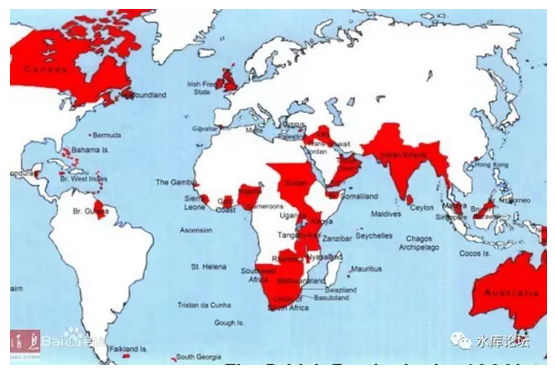
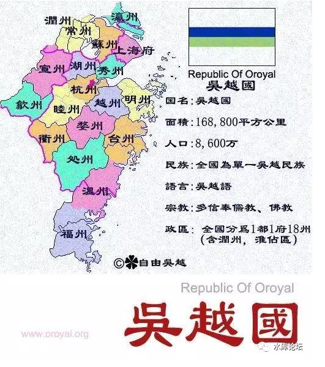

# 平等是伪科学么？

 

 

一）大革命形势

 

今天我们整个国际社会，基本是按照法国大革命的模板来的。

 

你看世界地图，有明显的国境线，行政区，治外法权，和关税等概念。

 

 

但是，从来没有人想过。

法国大革命这个模板，是正确的么？

 

仔细说来，法国大革命这个模板，其实是高度巧合的。

我们的国际社会长成这个样子，是高度巧合，而不是神择的结果。

 

 

1）法国大革命时，砍掉了法王的脑袋。

 

砍掉了皇帝的脑袋，即使得"契约\-\--封建"关系不复存在。

层层效忠的格局，找不到了汇集点。

 

 

2）法国大革命，消灭了贵族。

 

法国人特别痛恨"三级社会"。因此法国大革命荡平了贵族，使得全国"均质化"，平坦成一片沙丘。

用冬川豆的话，叫做"没有土豪的世界"。

 

平等这件事，是重要线索。

 

 

3）来复枪创造了平民正义

 

因为极其偶然的军事革命，来复枪拉近了精锐军队和平民的距离。

使得法国社会更加扁平化。

平民获得了政治发言权。在这个特殊的时代。

 

而军神拿破仑，则把法国钢印强化。

 

 

4）法国掀起了民族主义

 

法国人的"民族主义"是有历史渊源的，高卢人向来以他们的长棍面包自豪。

 

AD1428年，圣女贞德自称在"梦中"被上帝感召，赐予神启。进而发动群众，抗击英军。

当时正好是英法"百年战争"的收尾时期。法军一败再败，接连丢失巴黎，新奥尔良等核心城市。法王剩下国土不足1/3.

 

圣女贞德凭借极少的兵力连战连捷，在"完全没有"贵族王室支持的情况下，仅仅凭军旗和感召，扭转局势。

 

 

圣女贞德力量从何而来，就是民族主义。

她几乎是历史上第一个提出来，依靠文化和渊源，而不是王权，决定士兵战斗的意义。

 

"同胞们，团结起来"。

"如果英国人长期占据法国土地，我们就吃不到Croissant面包了"。

 

 

因此，法国人的"民族主义"是有历史渊源的。身为欧洲大陆上最繁华奢侈的国家，法国人一向以"法国文化"自傲。

 

在大革命时期，大革命摧毁了贵族阶层，也摧毁了契约关系。

法国境内，有许多诸侯，是具备"双重效忠"身份的。他既是法王的臣属，又是西班牙的臣属。

 

法国第五大城市尼斯（Nice，蔚蓝海岸，戛纳电影节），一直到法国大革命兴起，仍然是法国/意大利的双重领土。

革命党暴军攻克了尼斯，并最终并入法国版图。

 

 

可见，当大革命来临时，一群暴民斧头党挥舞着斧子，冲进来庄园里砍杀老爷和神父。是肯定引人不满的。

"安德鲁伯爵怎么说也算西班牙的臣子，而且还是公爵的弟弟的表姐夫的小舅子"。

 

法国大革命砍了路易十六的脑袋，毫无疑问，就引来了欧洲列强的干涉。

周边所有国家，几乎都对法国宣战了。

 

 

这个时候，革命党人想要保住"大革命"的火炬，仅仅靠传统军队是打不过的。

他们象圣女贞德一样，最终关头，只能求助于"民族主义"。

 

大革命的号召，所有讲法语的人，团结起来。保卫法兰西文化。

你喜欢咖啡么，喜欢芝士么，喜欢宫廷舞么，那请你拿起枪来，保卫法兰西。

 

法国几乎完全凭"民族主义"动员，扛过了周边国家第一波攻击。

然后出了bug级的"军神"拿破仑，解决第二轮攻击。

拿破仑本人没扛过第三轮攻击。

 

 

 

二）宪制平等

 

以上种种历史事件，无数情况巧合。汇聚而成

 

彻底平民化的宪制政府

 

这句话，您再看一遍；

您再看一遍；

您再看一遍；

看出了问题没有。

 

 

全世界170个国家，基本都实行了"宪政"。不管顶球否，至少名义上颁布了宪法。

全世界所有的宪法，你翻开第一条，第一条永远一定肯定都是：

宪法面前人人平等

 

 

但是这句话，[是有很大问题的]。

在一个象俺这样无可救药重度怀疑论者不可知论晚期的眼中，世界上任何定律，都是要打一个问号的。

 

 

宪法规定，人人平等。

凭什么宪法要规定人人平等。"平等"什么时候和"宪制"划上了等号？

 

经过了无数次深入和痛苦地思索，你终于发现："没有道理"。

"平等"和"宪制"划等号。纯粹出于历史上一场意外。

 

 

 

三）民族国家样板

 

因为在法国大革命的历史上，他们废除了皇帝，废除了贵族，接着在外国干预下，采取了"全民总动员"民族主义的形势。

因此法国大革命的产物，是"无差别的平等宪制"。

 

现代民族制国家，照抄法国大革命。所以大家也都抄得有样学样。亚非拉三好学生，无论哪个国家拟定宪法，提笔就写："宪法面前人人平等"。

"王子犯法与庶民同罪"

 

 

 

但事实情况呢，民族制国家一运行，就遭遇到了无比多的困难。

最先的报应是法国。法国通过"民族主义"，号召全世界的法国人回防。守住了法兰西国土。

 

但很快法国人就发现，他们没法扩张了！

因为内外有别。你确立了法国认同"共同体"的边界。你也就确立了"非法国"的边界。

 

 

很多人，一看就不是法国人。譬如莱茵河对岸，讲德语，沉默寡言一点都不浪漫。

人家身份认同是德国人。

因此普鲁士扩张时，法国人只能干瞪眼地看着。普鲁士吞并邻邦，逐渐成长成一个大国。

法国人一寸国土都没有增加。

 

 

 

在我们之前的"史料菟集"中，讲了一个菲律宾独立的故事。

美国人，是第二重受害者。

 

全世界学习"法国大革命"模板。纷纷建立"均一化""平等无歧视"的大同王国。

然后美国看着菲律宾，感觉头疼了。

 

 

 

二战之前，1933年美国有1.3亿人口，信奉新教。

而菲律宾，有足足9400W人口。全都是穷得穿不上裤子，而且信天主教。

 

1933年美国政治家发急了，非得急着把菲律宾踢出去。让他赶紧独立。

因为在1933，面临一个非常大的政治危机："菲律宾人有没有选举权"。

 

 

如果你坚信"一个国家，一部宪法，众生平等"的话。

那么参议院，众议院，你准备给菲律宾人几个席位？

 

美国人一算，吓傻了。

当时的美国，还不是一个"福利国家"。美国福利始于罗斯福，1933虽然有了一点，但和今天奥巴马政府完全不能比。

 

如果放到今天，9400W穷得穿不上裤子的菲律宾，直接提升到美国福利"国民待遇"。

总统抹脖子跳海算了。

 

知道墨西哥人为什么最恨美国人么。

墨西哥人恨的是，"美国为什么只吞并一半墨西哥"

 

 

 

民族国家的第二个弊端，是他完全无法"扩张"。

如果大家完全"均质"，一人一票的话，我还要扩张干什么。

 

举个例子，美国的军事实力，是埃塞俄比亚的无数倍。

美国可以轻易击败埃塞俄比亚的军舰，开进港口去抢香蕉，番荔枝，牛油果。

 

 

 

可是现实生活中，美国会侵略Ethiopia么。绝对不会。

这无关于"军事"，而是基于"政治"。

 

看见美国人来"侵略"，埃塞俄比亚人高兴坏了。

他们赶紧集体"投降"，大家一起并入美国。

 

然后你就要给我美国人的"国民待遇"，美国人的"人权"。

我反过来当参议员。三军司令还要听我的号令，给我乖乖地发食物券。

 

 

 

我们看中国史书，史书上诸侯是特别喜欢"征战"的。

哪怕分裂成三国，也是要互相吞噬。一定砍杀到只剩最后一家为止。

 

因为战争的背后，其实都是"利益"。

对于农业社会，最重要的收入是"农税"。我占据的地盘越大，我的税收越多实力越强。

 

 

但是到了民族社会，西方列强进行"民族化格式化"之后，一下子都变成了病猫。懒洋洋地殖民时代结束。

因为"战争"意味着抢劫，唯有暴力才有抢劫。

 

战争本身就是一件"不平等"的事。

战胜者抢劫战败者。

 

 

如果你一个国家实行"平等"了，以平等作为基本国策。

则你根本不需要战争了。赢的人也没法抢输的人。

 

1789至今，天下太平！[\[1\]]

 

 

 

四）殖民地崩溃

 

 

"民族国家"带给生物体的基因崩解，还不止这些。

很快西方列强发现，他们不仅仅是不能"扩张"。而且连原有的殖民地也保不住。

 

 

二战之后，"亚非拉独立运动"如火如荼。各殖民地小邦纷纷建国。

丘吉尔曾为了拯救一个帝国而战斗。战胜的结果，却是丧失了大英帝国。

 

 

今日的教科书，把"日不落帝国"崩溃解释为大英帝国实力衰退。

这纯粹是胡说八道！

英国崛起时，不过英伦三岛一叶小舟。当时可以征服世界，凭什么现在反而要撤退。

而且英法联军，对于第三世界殖民地军事，是压倒性的代差差距。你看看今天的非洲阅兵就更明显。

 

"日不落帝国"崩溃，不是因为军事原因，而是因为政治原因。

"二战"之后，苏联得势，全球左倾思想急剧抬头。

 

欧洲的"白左""圣母"当时就已经登上历史舞台。

对于"白左"来说，顺着"平等"一路推演下去，他一定是无解的局面。

 

"殖民地算不算英国公民"，

"殖民地护照能否自由进入英国"，

"殖民地货物能否免税进入海关"。

 

 

这些问题，一个比一个尖锐。一个比一个无解。

那些在议会敲着靴子，义愤填膺，痛斥资本主义无耻的"正义昂然"议员们，你是无法击败的。他背后站着白左群众。

 

 

而如果给予殖民地更多的"人权""福利"，就意味着大英帝国的崩溃。

譬如说，菲律宾不过9400W人口。

印度三哥有整3亿人呢。

 

如果要给三哥以"人权"，怎不把英国议会吓得魂飞魄散。

老牌政治家们计算了一下，所有的殖民地，一夜之间都成了"负资产"。

 

得，算了，您独立吧。

英国人祖先花了整整三百年才打下的江山，不到十年就败光了。

 

 

出卖英伦的，不是战场上浴血奋战的军士。

而是议会厅里"饱含热泪"的政治家。

 

 

\*
顺便提一句，日本完全照抄英国。日占时期，台湾实行的不是"日本宪法"，而是"台湾特别统治法"。

那部法案，也极其糟糕。不出意外的话，哪怕日本打赢太平洋战争。最多50年，台湾也非独立不可。

（但新政府可能更亲日）。

 

 

 

五）分崩离析

 

"民族国家"简直就象基因族谱错乱。分崩离析。

他第一步，不能再有任何扩张。

第二步，丧失所有已有殖民地。

第三步，连现有的国土也保不住。

 

 

白左宪法的精神，是"平等"。

而政治学第一定律，政治本身的定义，就是"抢劫"。

 

-   政治就是抢劫。

-   就是暴力武力分赃大会

 

 

当二个省份捆绑在一起，共同组织成了一个"国家"。

"中央"从组织层面讲，永远是"拿A的钱补贴B，拿C的钱补贴D"。

 

也就是说，只要"中央"存在一天。

永远有吃亏的省份，和赚便宜的省份。

 

（网络流传吴越国，江浙长期以来是净税赋省份）

本人身为沪人，但我却是支持"大一统"王国的。

大一统长远来看，有非常大的好处。

 

 

但是欧洲很多小邦并不这样看。他们本来已经是二流国家了，也并没有"争霸天下"的野心。

因此在"民族制度"下，大家都吵着分家了。

 

捷克和斯洛伐克，分成了二家。

南斯拉夫不复存在，一切为六。甚至还冒出个科索沃。

西班牙北四省要独立。

Quebec要从加拿大独立。

苏格兰要从UK独立。

 

 

民族国家内生性有一种越长越小的倾向。

细微的省份差异，可以被无限放大

 

 

 

六）结语

 

"民族国家"架构是一个怪胎，没有经过历史和神罚的考验。

从他诞生的那一天起，他就在基因崩解。

 

第一步，他使得咄咄逼人的欧洲，再也没有了扩张的力量。

第二步，他丧失了300年来获得的殖民地

第三步，他使得欧洲无限分裂。最终会分裂为诸侯林立的小邦

 

 

如果说，以上质疑还仅仅是"芥藓之疾"。

那么下一章，他真正要遭遇大麻烦了。

 

 

 

（yevon\_ou\@163.com，2017年3月8日午）

 

 

 

 

[\[1\]]有人说，"民族国家消灭战争"，这种话你怎么说得出来。一战死了多少人，二战死了多少。

的确，一战二战死了7000W。但这些死人，是基于工业化，火药武器杀伤力的进步。

如果不是因为"政治"变局，如果退回到中世纪那种"灭国"式外交关系。则死的人不是7000W，而是7亿。
