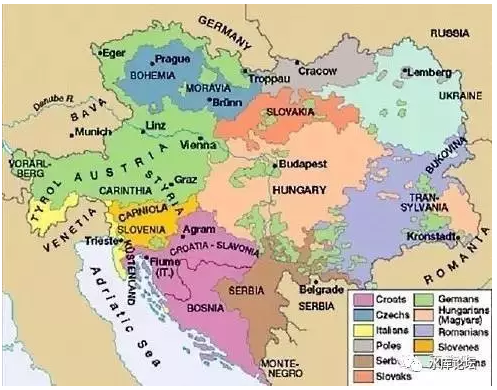
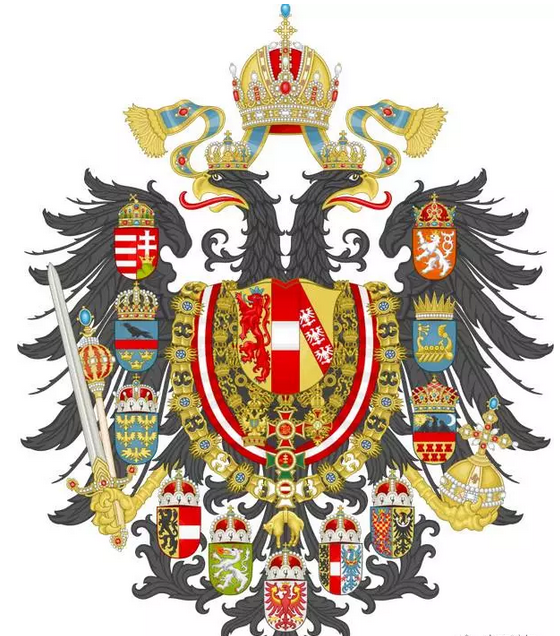
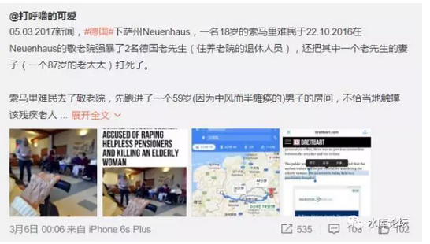
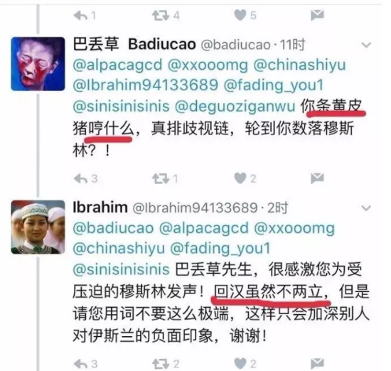
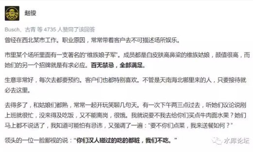
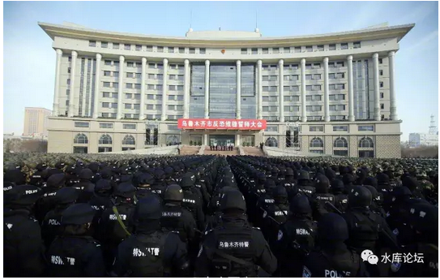
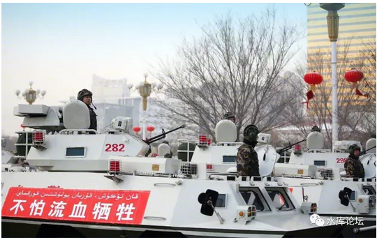
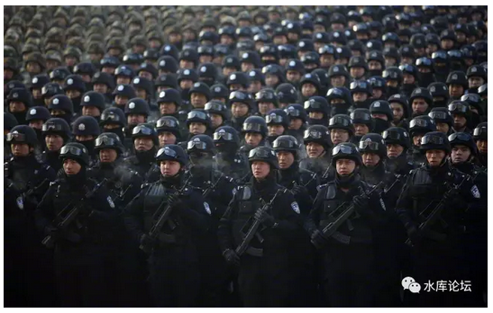
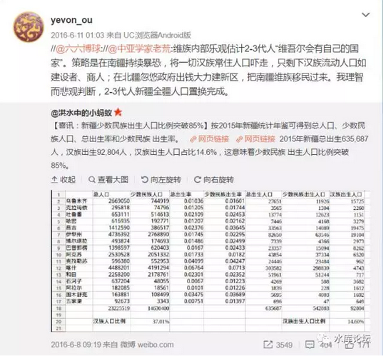

# 人民中的敌人

 

 

一）奥地利

 

最近几个月，看到写得最好的文章，是梅新育的《主体民众抛弃政权现象及其警示》[\[1\]]

 

在文中，他举了奥匈帝国，苏联解体，特朗普大选三个例子。 

 

奥匈帝国的故事，说起来十分简单。

"奥地利"是欧洲基督徒在抵抗伊斯兰奥斯曼入侵中，逐渐组织起来的一个国家。

 

其核心，原先是"维也纳"的城主。

1683年土耳其势力达到鼎盛。唯二次打到维也纳城下。如果打穿Vienna河谷，伊斯兰就会染色整个中欧。

当时，大维齐尔写给奥地利的国书，其开头是"致：维也纳城主"。[\[2\]]

 

 

此后，为了长期对抗伊斯兰世界。欧洲各小邦诸侯们，团结在了维也纳的周围，形成一个联盟。

而哈布斯堡，则广开后宫。通过广泛而惊人的联姻，取得一系列封建领地的继承权。

 

 

（数一下，国徽上有多少盾牌）

从左到右分别是哈布斯堡、奥地利、洛林。周围的盾徽从左上角开始分别是：
匈牙利王国 加利西亚及洛多梅里亚王国 下奥地利 萨尔茨堡公国施蒂利亚公国
蒂罗尔伯国 克恩滕-克莱因公国 摩拉维亚边区-西里西亚公国埃尔代伊大公国
伊利里亚王国 波希米亚王国。

 

奥地利皇帝是以上所有公国的"王位血统"继承人。

而这么多块领地，彼此风俗却是独立的。匈牙利，伊利丽亚，波西米亚习俗完全不同。

 

作为一个横跨中东欧，人口超过5000W的超级帝国，"奥匈帝国"是民族主义格式化的最大受害者。

 

皇帝弗兰茨二世哀叹说："我的国家像虫蛀的房子，移动任何一小块，谁也不知道会坍塌多少。"

 

 

 

很多人都在问，如果玩《维多利亚2》，奥地利应该如何开局。

又或者你穿越回茜茜公主身边，能如何扭转政局。

 

答案是：无解。

天底下最无可匹敌的力量，是"大义"的名分。

当人民信奉"民族主义"，且认为民族分治是正义的。则奥匈帝国的瓦解不可避免。

 

 

你唯一的出路，是篡改"大义"的名分。

你也要提出一整套社会理论，一整套秩序运转的法则，来告诉臣民们"多民族"是有好处的。

象后世的Lenin，玩这个版子就玩得很好。他顺利通关。

 

 

 

二）逆向歧视

 

言归正传，在1918年的历史中，奥匈帝国是如何运转的呢。

他采取了"逆向种族"主义。身为主体民族的奥地利人，却成了二等民族。跪舔少数加盟派匈牙利。

具体可参见梅新育《主体民众抛弃政权现象及其警示》。真的是斑斑血泪。

 

 

苏联到最后是怎么解体的。是主动玩完的。

当"布拉格之春"，捷克人想要脱离华沙东欧联盟时，苏联人毫不犹豫将坦克开进了布拉格。

可是90年代苏联崩溃，波罗的海三国，中亚五斯坦，这些加盟共和国独立时，并没有坦克。反而放鞭炮的。

 

是俄罗斯人，放着鞭炮，鼓掌送他们"独立"的。

是俄罗斯人不想玩了。

身为主体民族，俄罗斯人已经付出了太多。做了太久的二等公民。积累了太多的怨恨。

一等洋人二等官，三等少民四等汉。

 

 

奥匈帝国为了换取匈牙利不脱幅，几乎捧着笑脸，给了匈牙利人远远超过奥地利人的政治福利。

"少数民族"成了不折不扣的特权阶层。

 

2016年苏格兰公投，要求脱离UK。

英格兰人慌忙大开支票，养活苏格兰1/3人口只拿福利不工作。

今年他们又闹了。

 

 

这些都是不折不扣的敲诈勒索。并最终会吸尽帝国的血液。

苏联毁于计划经济。

USSR毁于逆向歧视。

 

 

 

三）"逆向歧视"的深层原因

 

逆向歧视的真正原因，出在"民族国家"这个模板上。

这个模板，本身就是逻辑不自洽的。是荒谬的！有bug的。

 

 

我们再回想一下，1789年法国人刚发明这个模板时，他是假设于100%的国民都是法国人。

所有人都吃法国面包，所有人都受"最后一课"法语教育，所有人都自豪并且忠诚地爱着法兰西。

体系中没有容忍"二五仔"的存在。

 

 

"民族主义"模板，从来没有解释过。

如果你的血液中有"异族"怎么办，有病毒怎么办，有癌细胞怎么办。

 

 

当这个"异类"的比例很小。譬如0.01%，这个时候"民族国家"开出的药方是"福利包养"。

好比每个国家都有穷人，每个国家都有不如意的人，反社会的人。

 

哪怕如日本这样"纯血"的模范民族。

照样有赤军存在。

 

 

"民族国家"给出的答案，是"养起来"。

譬如你身为日本人瑞士人，无论哪个穷困小山村里，政府负责你的教育，负责你的医疗，负责你基本生活补助。

因为民族国家99.99%都是正常人。所以这个"弱者补助"还负担得起来。

 

"福利社会"是一剂吗啡枪，并不能真正医治疾病。

但是当穷人很少时，马马虎虎也粉饰太平过去了。

 

 

 

真正的麻烦，发生在"异族"占到20%，甚至30%的时候。

例如"奥匈帝国"中的匈牙利，苏联加盟共和国外围一圈卫星国。

 

你设想一下，一个群体中，有20%始终保有非常大的离心力。

天天想要独立，搞自己的国家。

而你为了"国家统一"，还非得花狗粮拉住它。这成本就非常高了。

 

 

 

所以说，只要你是"宪法面前人人平等"的民族制国家，你就一定会发生"逆向歧视"事件。

在封建王朝中，没有这种怪事。

在马克思主义中，没有这种怪事。

但一旦民主讲人权了，立刻就"逆向歧视"。

 

皇帝可以制威天下，而总统几乎无法扩张。

问题bug，出在"平等"二字。

 

 

 

四）伊斯兰

 

如果说"匈牙利"还仅仅是初级阶段。奥匈不对眼，还属于人民群众内部矛盾。大家都是欧洲人。

真正的癌症晚期，要等到2016年"伊斯兰"正式登场。平等民族国家的bug显现无疑。

 

 

 

伊斯兰是什么，是一群养不熟的白眼狼。

意思是，你好心好意拯救难民。把他们从叙利亚救出来。

 

给他们吃，给他们喝，每个月还发1400欧元生活补助。

当成自己国民"一样"对待。

 

可是人家根本不把你当"自己人"。

人家吃你的，用你的，花你的。

吃完后在你家扔炸弹，强奸你的小女孩，杀光你的神甫，还要抱怨伙食不好吃。

 

伊斯兰的内心是魔鬼，你怎么可以把他们当人看。

穆斯林就是养不熟的白眼狼。你可以想象么，一个中国学生。

政府关心他，给他吃，给他喝。让他读书，补贴他的生活费用。

而最后，留下的却是：

 

（http://www.weibo.com/5967929112/ExVPRluKR，温和派穆斯林发言）

在穆斯林眼中，好像全世界都欠他的。

你待他再好，那也是应该的。而且是安拉赐福给他的，不是你的功劳。

 

 

而他对于你，就是一百个看不起。动不动把你烧地狱，觉得卡费勒都是下等人。

 

【都是香水惹的祸？穆斯林阿訇：科隆性侵被害者们也有错】Breitbart新闻网报道，科隆Al
Tawheed清真寺的阿訇（Imam）Sami
Abu-Yusuf在接受俄罗斯电视媒体采访时表示，科隆性侵案的那些女性受害者有错："新年夜的性侵事件是那些女孩子们自己的错，因为她们着装半裸，而且还用香水"

（https://www.zhihu.com/question/49295364/answer/116769360）

天底下的事，最怕的就是"不讲道理"。

你和他说规矩，他不听。不听不听就不听。不在一个频道。那你怎么办。来"文"的没法玩。

 

讲不听怎么办，讲不听只能揍了。

拳头是最好的道理。揍到你求饶了，你自然就乖懂事了。

 

 

可是在平等民主的国度里，你没法这么做。没法揍。

在英法等各国，早已经把"人权"提高到了一个非常非常高的标准。某些国家，甚至连死刑都取消了。

"高人权制度"必须适用于君子之国。

 

 

人的国度里，跑进来一群蟑螂。

对蟑螂也要用律师和心理医生好好哄着。对蟑螂也不能判死刑。

明明是你的制度失败呀！

 

 

 

归根到底，法国大革命所确立的"国民平等型"社会制度，它本身就是有bug的。

在小范围实行了一百年，丧失殖民地，丧失活力，化脓疾病不断。

 

而到了"大范围"一尝试，100W叙利亚移民涌入。

顿时把你的"宪法秩序"冲击得一塌糊涂。

 

昭示着你的宪法是[有问题]的。

是你自身制度出错。尽快纠错改制度。

 

 

 

五）结语

 

我这里有几张图片，是2017.02.27"新疆反恐誓师大会"。

 

你看看图片，武器精良，方阵如林。

 

你找一个新闻小白看了之后，肯定翘起了大拇指说："威武雄壮之师"。

你看那个小伙子，八块腹肌都闪亮啊。

 

 

而我的评价是：土鸡瓦狗，不堪一击。

什么，渣部队。

这可是最新式的WZ551装甲车，配30mm机炮。最新武器啊。[\[3\]]

 

 

嗯，没错。土鸡瓦狗，不堪一击。

因为决定一支军队战斗力的，最主要的并不是"军事"，而是"政治"。

 

象这样一支武警拉出去。其中绝大多数99%，是根本没有开任何一枪的机会的。

你武器再精良，装甲再厚重，战士再腹肌。可是你根本连开枪的机会都没有，又有什么用。

 

 

这支部队拉出去的效果是什么呢，遇见老太太过马路，该扶的你还得扶。

维族人家里失火了，你还得去挑水。做苦工。

 

你说反恐，可是敌人在哪里。

满大街的白帽子，人家不慌不忙地生孩子。生完孩子吃你的福利，养大孩子读古兰经。花你的经费，培养你的敌人。

非输不可。

 

 

你看，你看到了没有。

看见战士们脸上迷惘的神情了么。

因为他们不知道[为何而战。谁是敌人。]

 

 

 

按照你的玩法，新疆是非丢不可的。2015年，新疆少数民族新生儿635,687人，汉族仅92804人。

乌鲁木齐几乎所有的北疆汉人，心里都明镜似的清楚。"这块土地，终究是守不住的"。

我看你的"反恐大军"，如看土鸡瓦狗。

呸，不堪一击。

注定失败的结局。败军之将，何足言勇。

 

 

政治的事，归根到底还得政治解决。

"新疆问题"如何解决，我们下章再讲。

 

 

 

（yevon\_ou\@163.com，2017年3月8日晚）

 

 

\[1\]《梅新育：主体民众抛弃政权现象及其警示》http://www.szhgh.com/Article/opinion/xuezhe/2017-02-08/130318.html

[\[2\]]维也纳围城记是无数历史小说津津乐道的著名故事。

[\[3\]] https://www.zhihu.com/pin/820299985127096320

近期疑似武警加重火力迹象：2017年2月27日，乌鲁木齐反恐维稳誓师大会，近处采用武警涂装、WZ551底盘的装甲车配备30mm机炮，但是在细节上与92B式步兵战车不同。新疆军区机械化步兵6师17团或者某些边防团机动连的92B式步兵战车没必要为了一次誓师特意换身涂装赶去乌鲁木齐，所以这些配备30mm机炮的装甲车应该就是新疆武警自己的。可能是2013年新疆军区独立步兵1团被划给新疆军区特种作战旅后转交给新疆武警的，然后被新疆武警自行改进。
