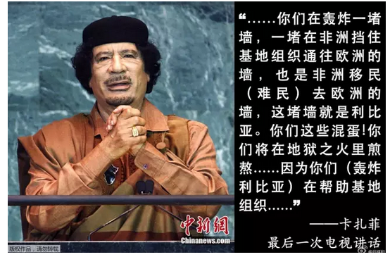
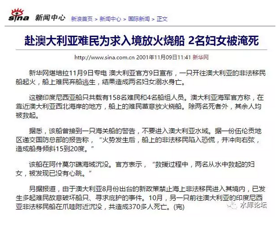

# 没那么复杂

 

 

一）治理困境

 

在王陶陶的笔下，伊斯兰教徒几乎是不可征服的。不可统治，也不可抗拒的。如原文：

 

伊斯兰教信徒与世俗社会格格不入的生活习性，使其难以适应个体式的离群索居，往往热衷于群居群聚的生活。这种群聚居住的方式，配合伊斯兰教本身强大的政治意志，使得穆斯林社区在与世俗政府基层机构打交道时，具有极其庞大的政治动员能量（不是军事动员力）。由于世俗政权的意识形态对于伊斯兰社区缺乏先天正确性，也难以借助穆斯林文化中本能的道德约束力，因此，脆弱的世俗基层政府（地方基层警务人员仅有十数人，乡镇编制大多不过百人），面对随时能够聚集起成千上万人的穆斯林社区，实际上极度缺乏管束能力（不得不借助于阿訇或者宗族的权威）------**这也就意味着，穆斯林社区在世俗政体下很多时候是无政府状态，也就是犯罪分子的无序天堂。**

 

源源不断的内地物资援助，促使南疆穆斯林地区的人口非正常增加，不断溢出其脆弱自然和社会环境所能承受的范围，加剧了当地的马尔萨斯人口困境，使得社会的稳定愈发困难。同样，驻扎军警的增加，强化了当地民众的疏离感，使得煽动者的言辞在当地民众变得可信，也不利于长期安定。从某种程度来看，这两项政策都属于政治毒品，愈援助，人口愈多，人口愈多民愈贫困，愈贫困则愈需要更大幅度的援助，周而复始，问题必愈发恶化，直至财尽兵穷。

 

 

在王陶陶笔下，他描述了一幅极为恐怖的图象:

伊斯兰象虫族一样，越长越多。少数的十几个居委会干部，宛如陷入了人民战争的汪洋大海。

随着统治的成本越来越高，帝国最终不得不（不是军事失败而是政治失败），放弃这块土地。

 

而王陶陶开出的药方呢，是南疆自治。划疆而治。

只有把伊斯兰留给贪财的阿訇，才能平复骚动的波流。

 
                        

他这篇文章看得我呵呵，哈哈，

哈哈哈！

 

笑得我眼泪都快要流出来了，笑得我满地打滚。

差点从凳子上摔下来。

 

 

我就问你一件事：

凭什么阿訇可以实行有效的治理？

 

 

凭什么我这里十几个村干部，带着最先进的对讲机。全套的通讯体系，和军工基础做后盾。

要坦克有坦克，要侦听有侦听。

要培训有培训，要组织有组织。保证都是职业/专业人士。

 

凭什么我们发达文明就不能统治你。

相反几个印度王公，老教门宦，蒙古王爷，却可以把这块土地收拾得服服帖帖。俯首帖耳。

 

 

 

我们再把脑洞开得大一点。假设我是一个军阀。

军阀，马匪啊。

 

如果哪一天，政府宣布南疆不要了。实在统治不下去。汉人中央政权要从南疆撤退了。交给你们自己玩去。

我是一个军阀。

我要求不高，你就把"反恐大阅兵"那些装甲车留给我。我就只要3000精锐步兵。

 

 

你让我玩，你看我能不能在南疆称王称霸。

南疆600W人，我就只要三千精锐步兵。你看我能不能扫平整个变乱，镇压得服服帖帖。

甚至开辟一个"世袭王朝"都有可能。

 

不难啊，你交给甘陕任何一个土匪，他都做得到。

只有你中央政权做不到。

 

 

 

二）统治

 

要说你中央政府为什么做不到，你首先要想一想："马匪"是怎样做到的。

 

 

你见到过马匪洗劫村庄么。

马匪100多号人，带着最先进的武器。杀光保安队，冲进村子来。

 

他们首先选最大，最豪华一间屋子住下来。挖起壕沟，架起铁丝网，机枪扫射，不和外界接触。

保证自己的安全。

 

然后，他们去村子里找几个头面人物。

"我要500块大洋"。

那个头面人物肯定双膝一软。当场就跪下了，"没有啊"。

 

"混账"，你扇他二个耳掴子。

"没有就去筹啊，还用爷爷教你"。

你看着地上跪着三个头面人物，拿出手枪，啪啪枪毙了二个。还有一个肯定吓得屁滚尿流，连滚带爬办事去了。

 

 

于是，你就在这个村子住下了。

每到了月头，你就让"村长"去村子里筹500大洋。日子过得舒服又惬意。

 

再过了几个月，渐渐的，你的老婆孩子也从河南，安徽都搬过来了。

"堡垒区"住的人口越来越多。

你就象是寄生虫一样，挤走了"原住民"。占领了这块土地。

 

 

 

好了，我们再换一个版本。看看"中央政府"的军队来了。是怎么做的。

"报告连长"，刚才进村的时候，砸死了买买提家的牛。现在他嚷着要赔偿。

"抓来吃了"。

 

"且慢，且慢，我们是正规部队，是文明之师。怎么可以干这种事呢"。

"赔钱吧"

"买买提说他这头是种牛，是天山神牛种。老精贵了，要配20万"。

"赔吧，赔吧"。

 

 

进了城，你逮了一个"头面人物"过来。

"我要500块大洋"。

头面人物一下子跪了下来。"大人，一块大洋也没有"。

"村子里上个月遭了灾，大雪压死了牲畜。现在还有20间房屋还没有修复"。

 

好了，您这支军队就成了"自带干粮"。

你不仅仅不可以从地方上汲取税赋。反而你还要投入，还有帮老百姓带去福利。

 

 

"不得了啦，有人朝土匪堡垒扔石头。骂他们是侵略者"。

"把他吊死"。

 

"不好啦，有人向县政府扔石头。骂汉人都要下地狱"。

"经过公正审判了没有"。

"有录音录像证据么"

"对方是否有心理疾病，是否未满18岁"

"二少一宽"

于是，一块石头变成了1000块石头，群众一起高高兴兴地上街抵制汉人。

 

 

 

我们一定要搞清楚，为什么十几个精干的乡镇干部"掉落了人民战争的汪洋大海"（净支出）。

而土司，阿訇，蒙古王公，印度王爷，却可以净收益。统治得如鱼得水，一点都不费力。

 

因为你下去，你是去提供"服务"的。

十几个乡镇干部，是真心真意为人民好。教导你要上课学习，要救病看医，要提供法律警察，造桥铺路，赈灾施粥。

判个案子，还要一审，二审，终审。

效率十分低下。

 

 

而王公呢，王公哪提供什么服务啊。

"报告，有人偷东西"。

"偷东西这最简单了，哪只手偷的啊"

"左手偷砍左手，右手偷砍右手"。

至于砍错了人，冤假错案，关我屁事。

 

 

因此，生活在王公，阿訇，土司统治下的人民，暗无天日。

被马匪作威作福骑在头上欺压，人权十分低劣。

而在中央政府统治下，过着奶和蜜一般的生活。时常还能拿些补贴，有做人的尊严。

 

如果有白眼狼硬要去做鬼，那我也没办法了。

 

 

 

三）二等公民

 

很多人不明白，为什么"太平日子"过得好好的。大家都很舒服惬意。北非的军事实力也不值一提。

 

可是随着卡扎菲，穆巴拉克等"独裁者"的垮台。宛如苍蝇罐头一样，盖子一开，苍蝇全飞出来了。

并且造成了欧洲的难民问题，席卷全球的偷渡问题。伊斯兰人口寄生爆炸等问题。

 
很多人不明白，这里面全部的奥秘，就是："二等公民"四个字。

 

 

在卡扎菲，穆巴拉克的统治下，你想要离开北非海岸，想到对面富庶的意大利去。

你会遭遇怎样，你会遭遇士兵无情的射击。

你的偷渡船，会被巡逻艇拦住。他们会直接把你扔进大牢。而不是什么"人道主义援救中心"。

 

这很公平，也很符合逻辑。

因为这是"利比亚"的生存界限。利比亚人，就配承受这样的法制待遇。

 

 

而卡扎菲，穆巴拉克垮台之后。

偷渡客可以直接渡到法国口岸。然后迎接他们的，是法国的巡逻水警。

接受法国人的福利待遇。

 

这事就没底了。寄生人口，象癌细胞一样地指数增长。

而偷渡的成功，更刺激了十倍的偷渡人口。

 

 

最初的时候，难民申请救助。

可是此后，欧美国家也吃亏了，认清楚了，知道是个坑。想要拒绝接受。

 

于是难民在船上杀小孩子，杀他们自己的小孩子。

当着西方所有摄像机，所有电视台。亲手杀孩子。

圣母们的心碎了。

 

如果你还不救，穆斯林就放火。

放火烧自己的船，不救就淹死。

澳洲屈服了..................西方文明危在旦夕，接近毁灭。

 

 

很多中国学生搞不懂。为什么穆巴拉克可以射击，而法国海岸警卫队不可以射击。

这里面，归根到底是政治的bug。

 

 

 

我们所学的政治，尤其是"法国大革命"之后流传世界的模板政治。他是基于"平等"的。

宪法面前人人平等，更推衍出一人一票。共享"国民待遇"国民福利。

 

在整个法国政治之间，他是没有双重标准的。

 

也就是说，法国警察，他不知道"怎样对待"偷渡客。他唯一学会的生活礼貌，就是对待[法国人]的那一套。

 

 

 

同样的道理，法国大革命传入苏联，变成共产主义。苏联再传入中国，变成社会主义。原本都是同源。

中国人在新疆，是相同的"西传"bug。

中国对于穆斯林，对于维吾尔族，给予的是"国民待遇"。

 

宪法面前一律平等，享有不受冤狱，不受连坐，不受禁入。接受教育，接受医疗，维持治安，给予最低标准食物保障等一系列关怀。

而对方偏偏不是汉人，而且不亲近汉人呢。

对不起，培训手册上没说。

 

 

 

欧洲的政治家们，呼吁回到卡扎菲，穆巴拉克"闭关锁国"的状态。

最好有一双黑手套，把非法难民没离北非就给毙了。远远地远离法国海岸。

不要给高卢雄鸡填堵。

 

王陶陶希望新疆"划疆而治"，把南疆交到亲中的阿訇，土司手里。

他剩下的下半句没说；

如果阿訇统治暗无天日，动辄砍手砍脚实行HALAL法。咱就当没看到。

 

二等公民，是解决问题的办法。

应该说，王陶陶已经触到了问题的本质了。

 

 

 

四）一国二制

 

如果一个人不爱国，他就不配成为公民

吃里扒外，扛着红旗反红旗，我们不要这样的马仔。

 

 

从我们小学一年级蒙童入学开始，老师讲"公民"和"市民"的概念。

核心概念，公民≠市民

这么重要的血腥政治学教训，怎么忘记了。

 

 

古罗马帝国，最初"罗马人"的概念，是非常狭小的。

他仅限于居住在罗马城中，自由人身份，襄同共和制的男性公民。

"罗马共和国"是由罗马人捍卫组成的。

 

此后，"罗马人"的概念几度扩充。

但基本上也是吸收各方顶级上层人物。尤其是精英。

长期以来，"罗马公民"身份，是作为一种赏赐品。赏赐给为罗马作战立下大功的蛮族将领。并获得了极高的忠诚度归属。

 

 

而到了AD212年，"白左崇高"的卡拉卡拉皇帝，要死不死听了"民权"份子的缀唆，"人生而平等"，硬是把罗马公民权普及给了所有平民。

于是，再也没有人为罗马打仗了。

 

罗马经历了一段50年换25个皇帝的混乱时期"三世纪危机"。

此后罗马一直走下坡路。昔日对蛮族百战百胜。如今却是力不从心。

 

AD212年，汪达尔人仅有1000多兵力奇袭港口，罗马都无力反抗。

罗马城被焚烧，千年帝国毁于一旦。

想一想当年罗马元老院对抗"汉尼拔"，众志成城齐心协力。区别何等明显！[\[1\]]

 

 

1789年"法国大革命"，为工业革命生产力关系摸索一种模板。

因为重重巧合，最终奠定了"平等，自由，博爱"作为宪法的基石。

可是这三个词，哪一个都没有经历过神罚的考验。

平等真的是正确的么？

 

推行"平等"之后，欧洲迅速地由殖民扩张变为温和收缩。

昔日笼罩在黄种人头上"灭种亡国"的恐惧，一夜之间消失无影。

 

之后再过了几十年，二次动荡，欧洲人甚至把丰厚的遗产"殖民地"都弄丢了。龟缩回欧洲本土。

而且龟缩了还不够，还在进一步收缩，分裂，簌簌发抖。

 

欧洲政治家几乎是哀求般的"请穆斯林不要跨过海岸"。

大航海时代西班牙人，绝对不可能这样说。

 

 

 

苏联，奥匈帝国，都是有一个流血牺牲的"主体民族"。

俄罗斯抗击纳粹，奥地利抗击穆斯林，艰苦卓绝前仆后继牺牲，才保留下了这片土地。

天底下哪有白吃的午餐。

 

"主体民族"浴血打开的财富，凭什么要和"被征服"民族分享。

"平等"本身就是非正义，荒谬并且解体的。

 

 

 

中国90%的人口是汉族。在中国最初实践"民族国家"时，并没有太多的水土不服。

可是当我们的目光放到新疆。我们迅速发现"平等"之bug。

 

有些人就是不把你当同胞。你好心好意照料他，给予他医疗和福利，辅佐他进入现代化。

可是他不能同化，融入你的血脉。反而要把你当仇人。

 
汉族的血统，极其纯净。主体DNA共性，高达98%以上。

在漫长的历史长河中，九黎，九苗，全都消失了。包括北方一些游牧民族。

这并不意味着我们"同化"能力强。

或许意味着我们没有耐心同化。

 

 

 

新疆的问题，真的要说，其实非常容易解决。

只要我们认识到"平等"是一个bug，真正的宪法中，应该是没有"宪法面前人人平等"这句话的。

只要没有宪法保护穆斯林。后面的事，都是雕虫小事。

 

 

（还有一章，未完）

 

 

 

（yevon\_ou\@163.com，2017年3月9日午）

 

 

[\[1\]]如果没有屠杀，要质量何用。公民化后的另一个缺点，罗马人的人口被赶超了。见《[降低人口质量，提高人口数量](http://mp.weixin.qq.com/s?__biz=MzAxNTMxMTc0MA==&mid=2651014601&idx=1&sn=3f23506d4914bdfdc33f676614f9e3d4&scene=21#wechat_redirect)》\#F380。
