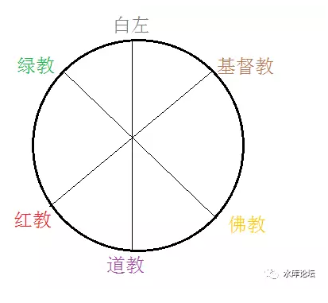
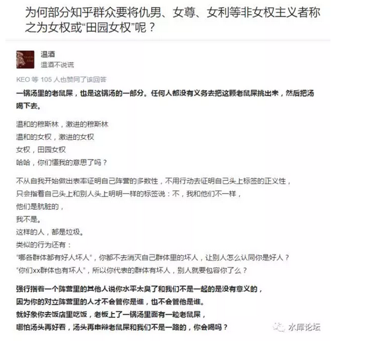
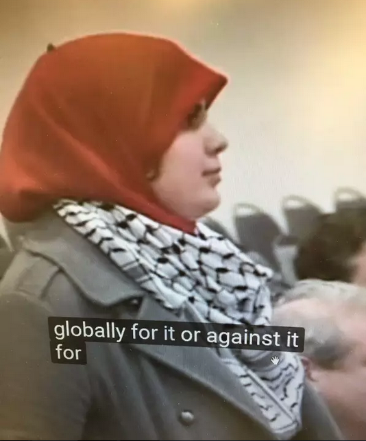

# 温和派穆斯林必须自己站出来。

和极端派"划清界限"。

 

 

一）爬阶

 

在田中芳树《银河英雄传说》中，作者讲了一个完全政治不正确的故事。

20000年后的时空，人类已经踏入了太空时代。

但是未来的政体，并不是"先进"的民主政体。

相反，莱因哈特带领的帝国，击败了海尼森的民主社会。全人类最终走向帝制。

 

 

科幻小说鼻祖，阿西莫夫的《基地》系列。

横跨整个银行系的川陀帝国。也并不是民主政体，而是帝室。

川陀崩溃后，边星极不稳定。也有"骡"的威胁。

 

 

那么，为什么在文艺小说中，人类未来的时代，并不遵循"先进""文明"的民主制度。反而大面积地使用帝制呢。

我们要反过来问，"凭什么人人平等"。凭什么未来人类就该是平等的呢。

 

 

河森堡说，全世界只有二个物种，会在没有食物压力的情况下杀害同类。一个是人，一个是黑猩猩。

河森堡没有回答，全地球那么多物种，有几个是实行"平等"社会的呢。

 

没有，一个也没有。

因为"平等"，它本身就不符合进化论。

 

 

"进步主义"是一个魔咒。人类每到一个新的生产力阶段，摸索新的生产关系模式。

向前的每一步，都有可能是"坑"。

 

"平等"只不过是人类"进步"的一次尝试，平等并不一定是正确的。也可能是大恶。

一切，都要等Test\--\>debug，看系统的运行。

等神罚的考验。

 

 

 

二）潘多拉魔盒

 

为什么西方社会如此地恐惧"不平等"，哪怕伊斯兰危机迫在眉睫，白左们也不愿意放弃"平等基石"。

象我这几篇文章，如果放在圣母婊的专栏里，早就"希特勒""恶魔""种族主义者"一大群头衔扔过来了。

李佳佳，张佳玮之流，开始写"特朗普大屠杀"。然后直接跳转至集中营犹太人的图。

 

 

我们必须明确地告诉各位，"不平等"是一个潘多拉魔盒。

这个盒子一旦打开。会飞出来一连串的东西。

不管你喜不喜欢。你必需通盘接受。

 

 

在最初的时候，仅仅是新疆伊斯兰问题。

王陶陶提出，让南疆自治。让阿訇管理穆斯林，保证低成本驯服。

 

 

其实王陶陶的建议根本就是痴人做梦。

阿訇治理，就一定会实行HALAL法。偷盗砍手，偷奸石刑，女人戴面纱。

你跑上去问，"且慢且慢，这个是中国公民，受中国宪法保护。依据中国刑法不能砍........."。

 

显然，南疆自治，首先要剥离公民普适的中国宪法。

这才是我们长篇五卷的原因。

 

而同样的中国境内，若分为一等公民，二等公民。

你觉得是应急之策，青霉素一针杀灭毒素。

长远来看，拿衣服啊。

 

 

"不平等"一旦开了一个头，就宛如打开了潘多拉魔盒。

譬如说，众所周知1966年时"地富反坏右"黑五类子女是不能上大学的。

工农兵，体制内的职位也都进不去。

 

当现代毛左唱赞歌时，他们没有意识到。耄本人就已经违反了左派的最基本原则："人生而平等"。

既然生而平等，那么黑五类的子女凭什么不许上大学。

 

 

这个例子说明的，"等级制"在中国是有丰饶土壤的。并且实践过的。

如果"一等公民，二等公民"拉开一条口子。

为什么不再拉大一点呢。

 

再过几十年，神州大地上又出现了"黑五类"。

凡是当权派看不惯的异见份子，统统打成"下等民族"。

 

这个"等级"的表格，还可以列得更长。

凡是"红二代"的子女，自动列为贵族。当官继承父辈的官位。

不要发笑。官场"隐性继承"在基层已经成为巨大毒瘤。

 

 

很多事是一环扣着一环的。

你以为你打开了第一环。

但实际他可以帮你拉扯出十七八环。

很快，中国就不是只有2等民权。而是有1\~18级民权。政治权力各自不同，贵族压迫无所不在。

 

您，准备好了么。

 

 

 

在中国宋代和清代，主人打死婢女，只需要罚银十五两，杖五下。

而婢女打死主人，则要处极刑。凌迟处死。

"良家子"才可以参加科举，商人的子女不可以考试。

 

"反帝反封建"搞了几十年。

你真的确定，这样的社会，就是你想要追求的社会么。

 

"不平等，等级制"是一个潘多拉魔盒。

一旦打开，后患无穷。

 

 

 

三）道教之理想国

 

我并不喜欢穆斯林。

但是同样的，人生下来就分血统。贵族阶层天高地远的社会，[也很令人讨厌]。同时我们也知道那是不可持续的。

那么，您到底要哪样啊？

 

 

道教之理想国。为此，我先说说按照奥派的观点。在"工业革命"的基础上，让全社会生产力最大化的方法。

"最大解放生产力"的理论制度是什么。

 

 

按照经济学第一定律，dT\>0

工业时代，首重交易。要让全社会要素大分工，大生产，大交易，整体物资才能极大丰富。

 

经济学第二定律，生产和抢劫。

交易存在的基础，在于没有抢劫。因此要在全社会的范围内，根除暴力。使得100%的人专注于生产，0%的人专注于抢劫，整个社会才能大富。

 

 

 

作为一个自由主义者。其实我并不反对伊斯兰教。

别人爱采取什么信仰，爱遵循怎样的生活规范，和我一点关系也没有。也懒得关心。

"关你屁事，关我屁事"。

 

我们持续反感穆斯林的原因，在于穆斯林"使用暴力"。

                             

你自己不吃猪肉也就罢了。何必要管我吃不吃猪肉。

你愿意信安拉也就罢了，何苦到我们这埋人肉炸弹。

你自己在阿拉伯实行奴隶女奴制也就罢了，可你想奴役我们的女人，那只能愤而反击了。

 

无论是做礼拜，一天五次的高音喇叭。

还是圣母婊，在地铁上非要拉着人扫[二维码](http://mp.weixin.qq.com/s?__biz=MzAxNTMxMTc0MA==&mid=2651015573&idx=1&sn=fd3e07be9114731e20b31a955445c495&chksm=80721f86b7059690be81f9dc0d8321cf232ebef16853da138f8f8596a5f276528df30fa9eb7e&scene=21#wechat_redirect)。

其本质，都是暴力。都是对他人空间的侵犯。

 

 

 

在各种宗教中，自由主义道教徒，和佛教徒是可以和平相处的。

和基督教徒，基本也能和平相处。

唯独和绿教徒，他们就不想和平。非得挑衅生事。

 

我们其实不是反对伊斯兰，不是反对宗教自由。

我们是反对"挑起暴力"。

 

 

 

进一步，一个生产力极大发展的国家，只要"无暴力"就能繁荣。

如果对方"暴力"，则抓起来，关监狱，紧闭。

那么还有一个灰色地带，"潜在暴力"犯罪份子呢？

 

除了"极端穆斯林"，还有"温和穆斯林"。

除了暴力犯罪者，还有潜在犯罪者。

对于潜在犯罪者。你该如何应付。各国各类的政治理论，都没有论述。

 

 

我们的答案是："歧视"。

对，就是歧视。

大大的二个字，歧视。圣母婊哭着喊着如怕大蒜的：歧视。

 

 

（https://www.zhihu.com/question/56067571/answer/148058128）

**一锅汤里的老鼠屎，也是这锅汤的一部分。任何人都没有义务去把这颗老鼠屎挑出来，然后把汤喝下去。**

 

 

"歧视"这个词，在奥派经济学中，是绝对正面的词。褒义的词。

任何人都没有义务，把老鼠屎挑出来，把剩下的汤喝下去。

 

所谓"歧视"，其实是信息成本。

而信息从来不是免费的。更不是天赐的。人权固有的。

我们在《[信息不对称是伪科学](http://mp.weixin.qq.com/s?__biz=MzAxNTMxMTc0MA==&mid=2651015322&idx=3&sn=458b83fb16bc48016e763526e1d60205&chksm=80721e89b705979ff1c3a3189cec1c172c59b251a1416c08bb9940bb5fbcaf16cf10e8bd2bd7&scene=21#wechat_redirect)》\#F750一文中写得很明白。

 

 

当"甄别"成本，超过了个体优秀的差异时。

你就应该歧视。

歧视才是成本最低的方式。

 

譬如说，你公司要招收一个CEO。

来了应聘者，"小学没毕业"。

甄别他是否"真正人才"的成本，远远超过了他可能带来的惊喜。就该直接拒。简历都不用打开。

 

 

又譬如说，Stream上打分极低的游戏，豆瓣上评分极低的电影。

一般都不值得打开。

当然，"低分垃圾桶"里可能也有好货。但是，除非有新的朋友推荐，否则浪费时间金钱干嘛。

 

 

 

"歧视"的本质是信息成本。信息成本越大，歧视越严重。

"温和派穆斯林"必须自己负责，将自己和"激进穆斯林"区分开来。

 

==\> 你们不能笑嘻嘻，乐呵呵地，指望着激进穆斯林埋炸弹。

而且好像觉得自己也是受益者，必要时无人检测还搭把手。

 

"激进穆斯林"的所作所为，必须牵涉"温和穆斯林"。

必须歧视，必须连坐。

 

"温和派穆斯林"应该是全世界最反对"激进穆斯林"的人群。而不是相反。[\[1\]]

 

-   你自己向全世界解释，你们俩不是一伙的。

-   杀最多的ISIS，提头来证明。

-   否则，被歧视，被排挤，被连坐，都是活该。

 

 

 

四）社会架构

 

好了，我们总结一下。"道教"框架下，是如何处理伊斯兰问题的。

 

1）所有人尽力生产。无抢劫。社会财富最大化

2）如果部分人信奉伊斯兰，暴力犯罪，则逮捕击毙

3）对"温和伊斯兰"，与罪犯类似者，进行歧视。

 

4）如果歧视正确。这派观点人获得更大生产力，更多发展。

如果歧视错误。这派观点的人生产力浪费闲置受损。被竞争淘汰。

 

 

奥派的精髓，在于第四点。

每一个人都喊自己是无辜的。裹着头巾的MSA，肯定说自己是无辜的，正义的，被欺负的。

 

（MSA女学生提问犹太演讲者，https://v.qq.com/x/page/p0374b9s92w.html）

这个时候，如何判断"正义"。如何判断谁是"劣等民族"。谁是"二等公民"。

答案是："歧视市场化"。

 

把"歧视"的权力，留给市场。

你爱歧视哪一类人，哪一类员工，哪一类种族，哪一类宗教信仰。招聘谁做员工，找谁做供应商。

[你自己决定。]

 

 

-   如果你的决策是符合"正义"的，那自然正确。会使得你的生产力增加，赚更多的钱。企业更庞大，在市场上活下来。

-   如果你的决策是"盲目"的。本来的善人，却被你无端端歧视了。排挤到竞争对手公司去上班。则你的企业肯定亏损，最终破产。

 

 

"歧视"市场化。

对"温和派穆斯林"的公开歧视市场化。

就是我们开的药方。[\[2\]]

 

 

 

（yevon\_ou\@163.com，2017年3月9日晚，全文完）

 

 

 

第七章其实本来要写[等级制社会]的构成。并非如此温和。

实在写不动了，病累。完篇吧。

 

[\[1\]]部分可参见游击队文章《人肉磨盘三两三》\#F880

[\[2\]]经济上的歧视市场化，形成稳定"价格"后。必然带来政治上的歧视。
