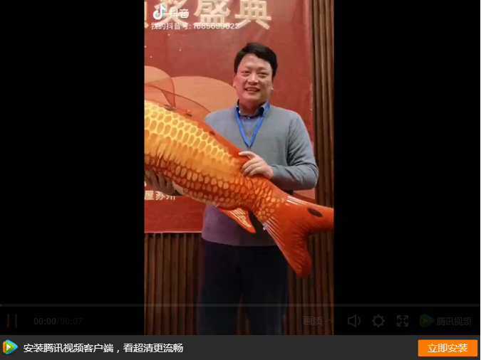
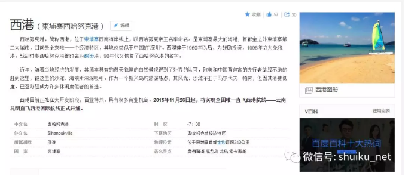
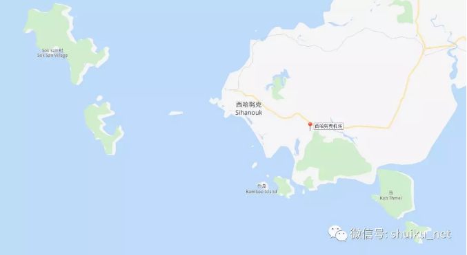
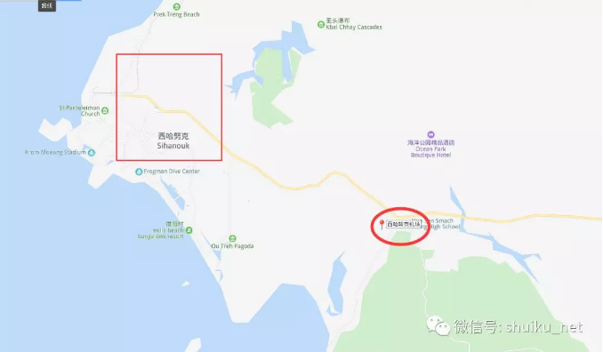
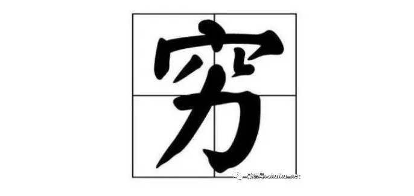
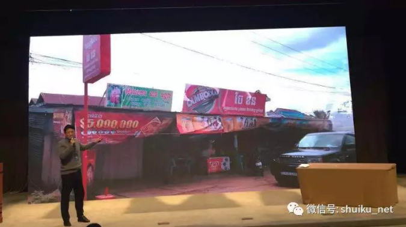
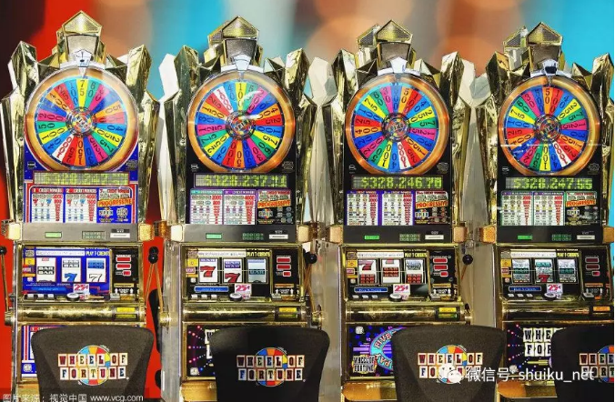
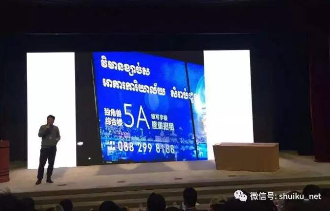
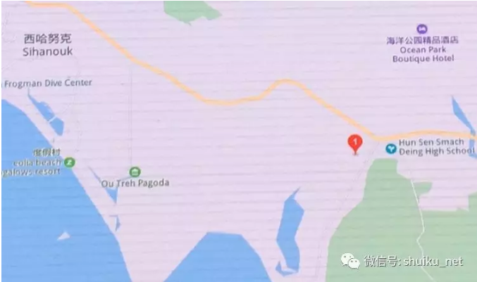

# 演讲稿【柬埔寨西港】

大家到这个现场来，并不是想来看我们的锦鲤颁奖仪式来。其实，今天下午我们会讲一段经济学的讲座，大家也不是来看经济学的。

 

这一次我让大家来，其实我想跟大家说，讲一讲水库2019年，也就是**我们明年的一些计划，我们的一些商业方案**。

 

大家飞过来都是来听怎么赚钱的，都是听一下我们有什么商业计划，能不能再帮我赚个几百万，这个才是大家关心的事情。

 

那么我们已经耽搁掉预定时间了，已经十点多了，所以我就抓紧一点。我们水库是房地产的第一大号，那么当然地产这一行有很多个大小V，但是他们都不能跟水库比，因为水库是一个体系。我们写了几百篇文章，内部的逻辑是一致的，**我们是一个体系，为什么要加杠杆？为什么要搞房贷？为什么要搞低单价的东西？**

** **

我们选择城市选择了重庆沈阳，这些都是一些被低估，非常有潜力的未来。那么**2018年说实话，房地产不好，对地产来说是个冬天**，那么很多在上海在北京的人都没有赚到钱，但是我们在重庆是赚到钱的。在沈阳我们刚刚建仓，只有第一批的人5000多的，赚到一点点赚钱效益。但是明年应该是有机会的，**如果行情起来的话，沈阳也是能赚钱的。**

** **

还有一个深圳，深圳是一线城市里面多多少少还有点行情，还有一些涨幅，这个都不错。你可以说我们在**2017年水库讲到重庆，2018年我们讲的沈阳，这几个单子都是不错的，都是可以赚的。**

** **

那么2019年，我们做什么？**2019年我们的方向会放在哪里**？**19年的事情还没有完全定下来，现在是一个草案，大家要记住**。**今天讲的所有事情完全可能没有发生，完全可能做不起来。是在考察阶段。我们有一个计划是一个非常大胆，而且空想的一个计划。**

所以我讲的是一个空想。所以今天这一段就不要再录音了，也不要录像，也把直播都关掉，不要像锦鲤一样直播。我们讲的是**西港**。

 

西港是什么地方？我9月份10月份去了两次柬埔寨，我地理学得不是很好，我一直以为柬埔寨是一个内陆国家，然后受功夫财经王牧笛，薛蛮子的邀请，他们跟我说，在西港有一个项目非常的有前途，你要不要过来看一下？所以，我是9月份的时候第一次去看的。当时我买了一个机票。机票是功夫财经订的，它的机票是西哈努克机场。那时我忙着写文章，我也没仔细看，我就随随便便过去了。

然后在飞机上我就看到了大海，我就觉得很奇怪，因为柬埔寨的首都是金边，大家都知道是金边。我一直以为他是金边市西哈努克机场。一直以为就好像说是武汉市天河机场，成都市双流机场。等到我上了飞机，我才知道原来我飞的这个城市不是金边，是西港市。

西港是一个单独的城市，在这个位置，然后它是一个港口，是柬埔寨唯一的港口，它是一个港口城市，这个城市非常非常的奇葩。城市下来呢，机场在这个位置，这个红颜色的圈，市中心在这个位置。

吃东西在这个位置。这个城市非常小，从机场到市区15公里，但是它的路面很差，他要开45分钟，我拍了五分钟，我的心就凉了。**我觉得这这个项目肯定没法做的，肯定是死路一条。**为什么？

**因为他的本地人穷得像猴子一样。**

然后你跟我说这样的城市一套房子要100万，我还想指望它涨价，涨到200万还想赚100万，这个是不可能的。这目的是忽悠我。所以我马上就去了，以后就吃他两顿日本料理，我就准备回来。我觉得这个项目是完全没有希望。

 

他的城市就这么大，西港城市市区就这么大，大概也就是五条街乘以五条街的规模，比中国的一个县城还要小一点。我们住在这个位置，就在这个索卡酒店，酒店

倒是不错的，有中国四星级的水平。

然后我要考一考大家。你们知道就这个猴子一样的地方，**当地人的收入水平是多少？**一个月的工资可以赚多少钱？

落子无悔，我要揭晓答案的。这一板块。数一下这个012345（五个0）。就是这个像投资一样破的地方。那么**为什么可以赚10万块钱一个月**？

**它的支柱产业是什么？**主要很多人都见过。**澳门在线娱乐澳门在线赌场。**然后，今年不是中国严打区块链，所以区块链有一半的人逃到了柬埔寨。**整个中国区块链的程序员全部都过**去了，有一半的币圈列举的人在那里。还有什么？**还有就是刘士余他不是严打什么tong业存款，投资理财，代客理财和交易吗？从证监会严打之后，这些人也过去了，还有在线黄金，在线外汇，在线巴拉巴拉，你懂的。**

这些东西全部都在当地。**当地五年之前5万人口，2018年35万人口，从一个小渔村在五年之内成长成了一个35万人口城市，其中的30万都是华人**，**主力都是程序员！**程序员都是高薪。当地的规矩，华人和华人去住，他们自己就关在里面。二十几岁30岁的青年过去，他就拿10万块钱一个月，他在那里做三年，我拿300万回中国，就是去捞钱了。

所以当地是一个非常非常奇怪的一个经济生态，跟我们中国国内完全不一样。

 

这个是最好的西港最好的房子，白沙皇宫，浓浓的杀马特。

这张更明显。这个是老虎机，老虎机你见过这样？就是老虎机背面是这个样子。

所以王牧笛叫我去搞，他说你去考察你的房地产，因为中国的程序员太有钱了，每个人都是月薪10万，而且有几几千几万个人在那里，他说那里的地产一定是大有可为。那我就过去看一下他当地的房地产，房地产是什么样子，是这个样子。大家觉得品质还不错吧，上面有一个广告牌，我知道你们都很关心的。广告牌给你个特写。有地址有电话。你高兴的话可以自己打个电话问一下。

 

**西港的房地产在什么价位？差不多是1500美金到3500美金一个平米**。那么折合人民币的话就是要1万到2万。像这样的房子差不多都要一百万左右。那我在想，我就吃一顿意料我就回家了。我就不想跟他玩了。我觉得王牧笛在坑我，我觉得虽然说这个地方很好，这个城市高收入人群，但是如果你现在已经卖1万8，两万，那么房地产是没有投资价值，我还不如买沈阳，不如买在国内，干吗要去你这个天涯海角遥远地方买2万块钱房子，对吧？

结果，王牧笛跟我讲了四个字，**以上全错**。

 

王牧笛说了，他说欧老师，我请你过来，请你吃顿日料，我不是让你看市区。去看什么？是在这个位置。

这个位置功夫财经拿了一块地，你想一想我们的策略是什么？他市区15公里是在这个位置，但是**他拿地是来在机场的边上，离机场非常近，机场出来只要五分钟，而且它地面硬化，马路非常好，路况非常好**。这里是一个云朗国家森林公园，绿颜色的都是原始森林，蓝颜色的是一条河，他在机场边上拿了一块地。

王牧笛跟我说：欧老师，我们不要玩房子，我们玩土地（这个百度地图没有google地图好，事实上这个是是条河）。这里是一直通到港口，它是通海口，就直接通到大海，就是这样一块一块土地，一个更清晰的。

**这块土地有多大？33000亩，我们可以把这整块土地全部都拿下来**。然后我说：唉呀，王老师你玩的这么大，我心脏有点...是不是我得开个会，跟我们水库的粉丝通通气，看大家怎么看这东西，有没有环境？

这里一共是23平方公里。33500亩，0.7个澳门的大小，非常非常大，33000亩的地拿上来是没有问题的。**我们有几个合伙人，一个是功夫财经，也是薛蛮子，还有一个台湾的财团，包括水库也是有实力的，**我们可以连续把这个拿下来。

 

**问题是这是一块荒地，他虽然是在机场边上，他现实是原始森林，什么东西都没有，什么东西都没有的话，关键是想怎么开发。**如果给你一块空地，从零开始，那么一般人会设想的开发方式是这样子的。

 

王牧笛跟我说：我先造一个栈桥，从河上过来有很多游艇码头，船可以停泊，然后这个黄颜色的是沙滩，那么我可以搞一些水上运动，像什么香蕉船，像那个什么摩托车啦，那个降落伞，摩托艇，它可以搞一些潜水浮潜，各种各样的水上运动。然后可以喝咖啡，搞一些沙滩排球，沙滩篝火，大家烧烤。然后下面的话就是商业，就别墅住宅，这是一个非常非常标准，房地产开发流程。

 

大家可以知道当地的支柱产业是什么？你懂了就可以了，所以基础产业做龙头做这样一个开发方式。

然后我就跟他说，我说王老师，你这个想法叫做**以上全错**，你是不可能这样做的，如果你这样开发的话是肯定会死掉的。

 

绝对是。死得不能再死。为什么？因为**我们可以看到各国各地政府都在搞特色小镇，都在搞那个什么一城九镇，但是特色是搞不活的，永远都不活的。**你没有这个流量，就算我今天造了这个东西，我忽悠水库的朋友每人买一套住宅，但是你买了以后，你三年都不会去一次，它是没有人气的。

 

如果你这样做的话，你是肯定死掉的。我说你应该怎么做，这块土地这么大，你一个人肯定吃不下。你也不是专业人士，你也不是经营水上乐园的，**你应该专注于你的主营业务，主营业务是什么？土地批租**。什么叫做土地批租？**我把这一块这么大的土地，我把它切碎掉，切成一百亩一块，然后我卖给有梦想有奋斗的年轻人。我卖一块1百亩的土地给你，包括一段河岸线，包括下面整个空地，能不能造？商业能不能运营，商业能不能造，别墅能不能造，住宅出去卖？**

你自己想办法，我就卖一块地给你，我就做土地批发。这样的话，我把这块大的土地我可以切碎，切成一千块小的土地，我卖给一千个，有想法有梦想，为自己构画未来的年轻人

那么，这一千个小V，他们会为了自己而奋斗，他们会像打鸡血一样地把自己所有的亲朋好友，所有的能调动的资源全部都调动起来，会拼命的吆喝，投广告啦销售啦，他都会去动。

 

**我就只做小，我只做批发，我们我把地卖给你，切成一小块一小块，你们来开发。**那么我们就要提到一个最最最最核心，就是最最关键的问题，价格是什么？

你认为一个可以造住宅的土地，它的价格是什么？比如说我号称卖一百亩的土地，**一亩地可以造多少房子？可以造20套**。

 

如果你能够卖到市区的价位，就是1万多一平米。一百多万一套，**每一亩地可以卖两三千万的销售额**。那么我如果卖一块100亩地的土地给你，你们猜需要多少钱？大家对土地的价格有没有概念？一亩地可以造20套房子，大家猜一下地价是多少？没有人给我数字。

 

对吧？。一亩地可以造20套房子，每套房子一百多万，**建筑成本很低的，建筑成本3000多一平米，忽略成本。**

 

如果这个项目推荐给大家，你自己去做一个开发商，你弄一块土地造几百套公寓，你自己来卖。（加灰xin：y
i q i 2 n 入
群）就是说如果你搞一百亩土地的话，差不多是人民币2000万。如果像一个小型的开发商就要30亩土地，600万就够了。**如果你做一个中小型的开发商的话，你只需要600万，就可以买30亩土地**。**这个价钱是已经包含了所有所有的打点费用，全部都包装打完以后，我们卖出给粉丝的价格**。

 

**我是第一道批发者，我卖给对外面第二道批发，已经包含一切费用。**

 

很多人都有一个梦想，她说我要一个独栋的别墅，独栋别墅有多大？一般就两亩地，两亩地的别墅在北京，要四，五千万。两亩地，如果你在西港买两亩地的话，成本只要40万。**中国人对于土地的热爱是深入到骨子里的，**只要我们说是卖土地，我可以把这帮你把产权做得很干净。**这个事情其实我们不担心不担心销路的。**我把它拆散掉，再乘一亩两亩的卖的话是可以卖的动。如果我给你一块大型的土地一百亩，把它拆成50栋别墅，分分钟可以把它零售卖完。

 

我不担心这个事情。**整个西港项目他唯一吸引人的就是它的价格特别特别低**，它的价格就只要40万，可以买两亩地。就是这么便宜。

 

所以我们才有兴趣探讨一下这个事情的可能性。然后大家都知道，我们在10月份的时候连续开了很多的会议，包括把各个水库的广大公司水库的小V，我们都召集到一起，我们已经闭门开了两个会议了。大家最后谈出来，就像我们按照水库系，整个水库系统，我们会抱团，抱团做成一个项目，我们的设想是怎么样的，还是一个栈桥，还是水，然后沙滩。

 

**我们可能整个水库系会拿一千亩的土地，一千亩的土地我们在当中会找一个西港当地非常有实力的财团，搞一个龙头性的服务业，不懂的**。

 

那后来我们卖土地的话是这样卖，按照这个框，这样一圈半给管家公司。每个管家公司就是拿这样一块，其中绿色的是商务区，蓝色的是住宅区。如果你拿地的话就必须拿掉。。我们跟管家公司说，商业区的话必须帮我们做成商业，不管是任何一种都可以。比如说打靶打枪，就是真枪。**在柬埔寨当地的话，弹药是合法的**，你可以让男孩子玩机关枪，这个生意是肯定会流行的，或者你可以玩那个嘉年华，玩那个密室，玩这个恐怖山谷，然后玩餐饮，按摩娱乐上各种各样的一圈的，我们会想办法把这围一圈商业做起来，外圈才是卖住宅。

 

这个事情是我们在跟管家公司商讨，如果能够做成的话，我会卖这样的一块土地给管家公司每一块的大小差不多是一百亩或者50亩，这样一块。然后我们在第一期的时候，会在这个位置，这个位置的话，**我们会拿一百亩的土地出来，把它拆成方格，一亩地一块地，二十万二十五万一亩地，一个小块**。这个是卖给水库的散户的。如果有谁想在海外拥有一块自己的土地的话，我们会卖一个小方格给你，就是一亩地。但是一亩地已经非常非常大了，如果你去现场看一下的话，你可以知道，这是一个非常非常异想天开的，而且非常非常庞大的一个计划，简直就是从平地放了一座城市。

 

所以我们也一直没有公开。我们只是在内部的研讨阶段，可能可以获得非常高的回报，也有可能会没有不了了之。如果我们可以把它造成住宅卖的话，它的利润是非常非常丰厚的。因为你一百亩的土地，造住宅的话就可以卖两个亿。一个普通的人，如果你做了这个项目，如果你自己有办法把这个一百多土地推销出去的话，你可以立刻变成亿万富，但是能不能做怎么做，是一个非常非常复杂的一个问题。
