# 水库微信号分析

原创： yevon\_ou [水库论坛](/)

**水库论坛**

微信号 Shuiku-net

功能介绍 科学尚未普及

2016-09-07

水库微信号分析

 

昨天，《上海楼典》微信号被封。\[1\]

作为一个拥有近200000订阅的大V，就这样消失得无影无踪。未免让人兔死狐悲。

所以今天停更一天，我们讲讲水库的微信号。

 

 

水库论坛，最早是一个BBS。由几个职业炒家合伙创立于2012.10.20。

2015年的大年夜。心血来潮，开了一个微信公众号。

 

截至到今天，2016.09.07，水库微信订阅号终于迎来了70000个订阅者。

 

其中；

-   4月13日突破20000粉

-   5月19日突破30000粉

-   6月24日突破40000粉

-   7月19日突破50000粉

-   8月04日突破60000粉

-   9月07日突破70000粉

 

我花了整整第一年的时间，写了大概90篇文章，才有了10000粉。

但此后就很快。尤其是五月中，经过布菁胥冯人文经济学会等几位大师联合推荐之后，涨粉迅速。

 

 

如果我们细看粉丝的构成，他大概是这样的。

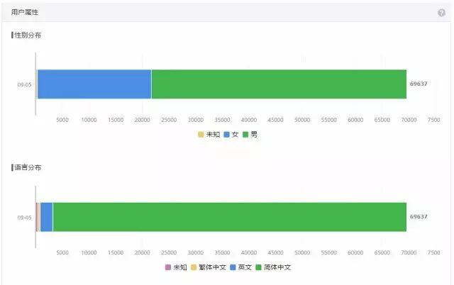

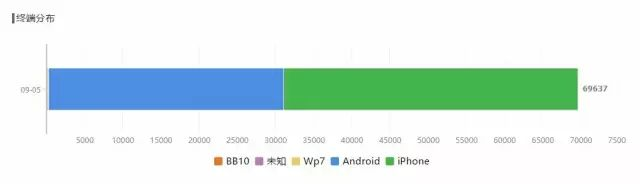

iPhone居然一直占据55%的份额，这是我始料未及的。

因为Apple在国内智能手机的份额不会超过15%，占水库比例真是惊人的高。

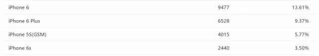

如果按省份的话，则是：

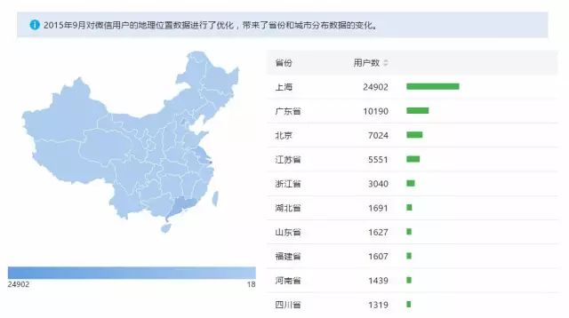

水库从上海起家。迄今为止上海仍占据绝对大头，约35%

京沪粤三个地区相加，约占了60%的订阅者。

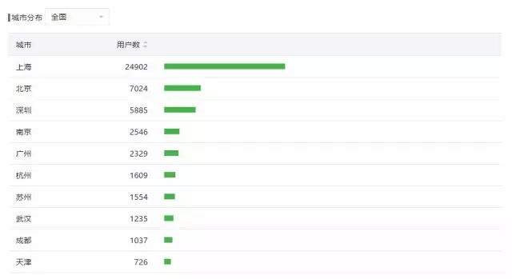

接着我们来看阅读；

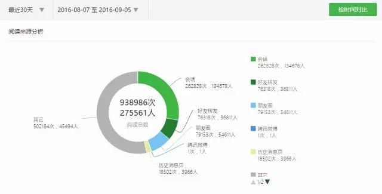

这是一个月的数据。

一个月之内，大约是100W次阅读，27W个人。

 

我不是很清楚这个数字是什么档次。不过SPI整天惨叫，说他去年2500W阅读，才涨了八万粉。

 

分小时的话，下午2:00是兵家必争之地。

可见，上班偷懒，是人类必有之现象。 

水库的价值，是毋庸置疑的。

江湖传言，甚至都有人在卖锦囊，定价￥2000元一个。

兜售在土财群叫嚣，"金光大道，不传之密。保你赚钱发大财"。

 

打开锦囊，里面就只有二个字："水库"。

江湖戏言，不用当真。不过阴暗面确实是存在的。

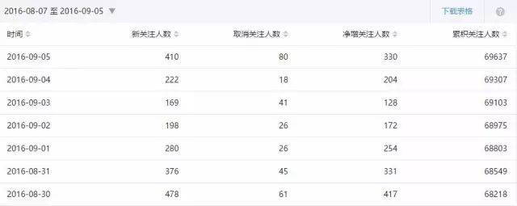

如图表，水库平均每天约有40人"取关"。

这并不是一个太小的数字。相当于每天流失用户0.1%

 

我不太明白这些人主动"取消关注"的原因。

不过他们迟早是要后悔的。

 

 

 

水库的特点。是我们的"阅读率"特别高。

目前业内皆知的秘密，微信"订阅号"打开率已经跌得惨不忍睹。

可参考阅读文章《互联网2016：流量都去哪儿了？》\[2\]

 

一般一个200000粉丝的大号，每一篇文章的阅读量，马虎也就10000左右。比例5%都不到。

可是水库论坛，基本保持着每篇14000左右的阅读。

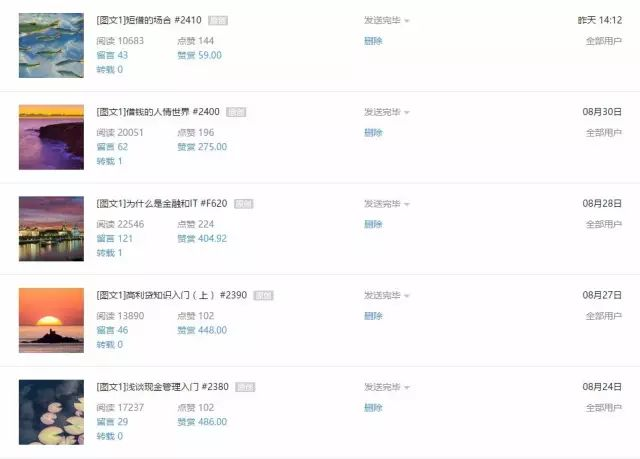

按照我们70000粉丝的比例，差不多有近20%的阅读率。这算是非常非常高的了。业内翘楚。

 

 

如果细化地分下去的话，\#F字头文章，肯定是要比\#数字阅读量高。

人民喜闻乐见的永远是八卦。这是改不了的。

 

我阅读量最高的一篇，也仅仅只有65000。

迄今为止没有任何一篇100000+的爆击之作。

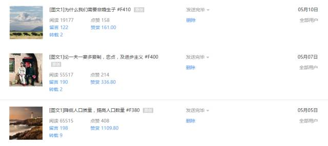

《降低人口质量，提高人口数量》一文，长尾得厉害。

当它刚刚发出前三天，一共才只有40000阅读。一般文章也就三天票房。

可它渐渐，渐渐的，居然每天都在涨200。四个月以后有了65515阅读。

互联网的"长尾"实在厉害。

 

 

阅读最少的，肯定是《拜金女郎》。

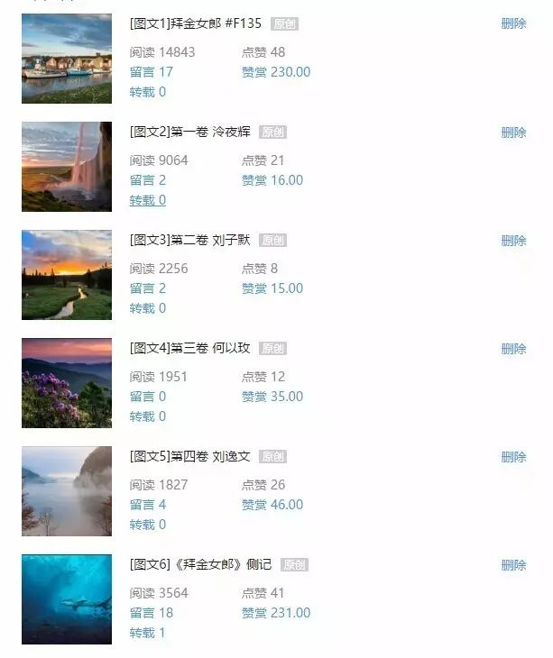
\
什么鬼。连俺LP"盗号"发了婚纱照都有12000阅读。

《拜金女郎》居然只有1951？

 

 

这事我无论如何塞破头也想不通。

《拜金女郎》才是我呕心沥血，用灵魂写出来的文章。

 

《拜金女郎》26000字，微信单篇文章的上限是20000字。

可是《拜金女郎》一个字也不能删。无一处删减处。

所以我只能分割成多文本。这极大地限制了她的传播。

 

 

一篇文章你要阅读量高。就一定要靠"转转转转转"。

订阅粉丝，是你的基本盘。保证了你的基础流量。可是要打爆击，就一定要"标题党"，要追逐热点，要哗众取宠。

 

譬如我们举二篇对比。

一篇是"三天前"发的文章。数字已稳定。

其77%的阅读，来自于"基本盘"。也就是长期订阅者。

 

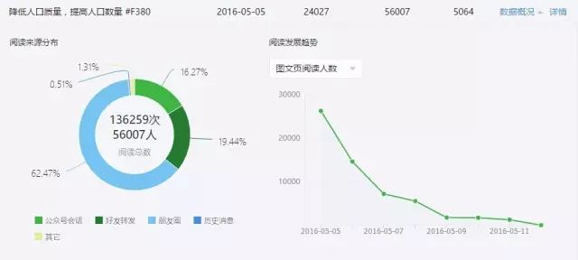

而对于这篇"网络热文"。长期订阅读者只有16%

高达62%的，都是靠朋友圈"转转转转转"。

 

 

这就是"学术文"永远斗不过"鸡汤文"的原因。

如果你要冲粉丝，冲流量，攫取眼球；

就一定要标题党，鸡汤文。让妈妈们转到朋友圈不觉得羞愧。

 

"写一篇王宝强离婚对房地产市场的影响呀"。

"呸，这么不要脸的事，只有你SPI干得出来"。

 

 

如果要说收入的话，从2016.2月，水库第一次冲破10000订阅。腾讯给水库微信号开通了"打赏"功能。

迄今为止，经过各位的不断赏脸，华丽丽的收入是：

 

(屏息)

(静气)

(惊讶)

(扶住板凳)

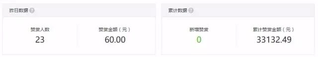

不错，水库迄今超过250篇原创文章。

我所获得的总打赏，一共才只有33132元。

数字之少，甚至还不够三小时工资。

 

而其中，还有[安好，悟水justin，薄荷三钱，Sally]等"惯例打赏者"。

打赏了无数次的88，200元。

对此表示感谢。

 

 

相比之下，"分答"账户我一共只开了二个月。

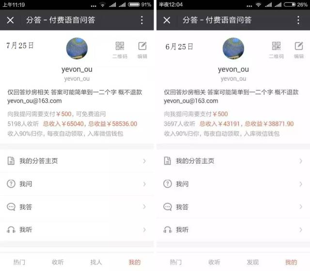

第一个月就赚了43000，二个月合计赚了65000.

仅仅二个月，收入就超过了"微信打赏"的全部。

 

前几天，"分答"的工作人员小妹妹，笑嘻嘻地找到我。

"叔叔您可是分答的大V呢"。

"哦，收入可以排进前100么"。

"大概可以进前50"。

 

在我们所有的"大V"中，您是唯一没有个人简介的。也没有描述。

V认证很难办呢。

您能否说说，"描述怎么写"。

俺想了半天，半天。这个问题实在是太难了，我也答不上来。

 

我能不能写"退休人士，27岁退休"。

IB被雷劈。

俺答应改天想想。结果第二天分答被封了。

 

 

同样是"网葒"，SPI二个号"上海房地产观察"和"上海房地产频道"。

大号是水库的3.5倍，小号是1.5倍。

和在一起，流量大概是5倍。

 

这个家伙收入可要高多了。差不多每个月微信号，就能赚（此处删除六个字）\~（应号主要求删除）元人民币。

数额之高，连哥哥这种长期缺乏现金的人，都有一点心动了。

 

而毕竟双方路线不同。他从一开始，就冲着"广告流量"去的。

你去看看SPI文章，号主不发财才真没天理了。

 

 

 

好了，说了这么多，想表达的意思是什么呢。

我亲爱的70000粉丝呀；

 

"要是哪一天，水库微信号被封掉了。记得一定回Shuiku.net，看看我们的新订阅号哦"。

"抬头，Banner上面就有。二维码扫一扫"。

"如果不幸阵亡，就会换新号"。

前二天把Shuiku.hk给买下来了。

如果Shuiku.net再被封，记得去Shuiku.hk哦。

 

最后重申一下，本公众号一贯爱国爱党。对中华民族忠贞不二。

电台人生四大准则:"不吃香烟，不吃老酒\[3\]，听老婆的话，跟共产党走"\[4\]

 

（yevon\_ou\@163.com，2016年9月6日晚）

[\[1\]]《上海市网信办依法处理18个违规微信公众号》http://mp.weixin.qq.com/s?\_\_biz=MzI1MDE2OTEyNQ==&mid=2651491640&idx=1&sn=134483a4a2209f76e7889613c9678201&scene=1&srcid=0906FSSfmM5QckdjOKbxevCe\#rd

\[2\]《互联网2016：流量都去哪儿了？》http://www.iheima.com/zixun/2016/0727/157702.shtml?comefrom=couti

\[3\]（ka）（fei）

\[4\]王汝刚的段子
